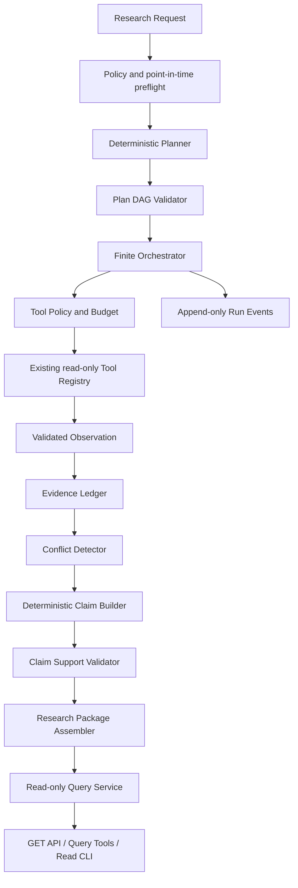

# Stage 7 Controlled Research Agent Orchestration Design

- Status: PENDING USER APPROVAL
- Date: 2026-07-23
- Required approval phrase: `批准设计并继续实现`
- Baseline branch: `main`
- Baseline commits:
  - `4b742e2 feat: add document retrieval and verifiable citations`
  - `5a61e95 fix: enforce stable line endings for rag fixtures`
- Baseline migration: `0005_rag_citations`
- Baseline regression suite: 1,264 passed, zero failed/errors/skipped/warnings

This document is the Stage 7 design approval artifact. It does not authorize a
branch, migration, dependency, Tool registration, Agent execution, model call, or
production-code change. Implementation starts only after explicit user approval.

## 1. Decision summary

Adopt **Route C: controlled hybrid orchestration**, with these Stage 7 runtime
restrictions:

1. A deterministic finite-state machine owns all lifecycle transitions.
2. `DeterministicTemplatePlanner` is the only production planner.
3. `DeterministicClaimBuilder` is the only production claim proposer.
4. Planner and reasoning provider ports exist, but no production model provider is
   implemented or configured.
5. Scripted planners and reasoners exist only under test support and cannot be
   registered by production composition.
6. Only canonical Registry Tools that pass Policy and schema checks may execute.
7. Tool execution, evidence validation, conflict detection, claim support, budgets,
   state transitions, and package assembly are deterministic code.
8. Model-originated output, if a future stage authorizes it, can only be an
   untrusted proposal. It can never directly become a supported Claim.
9. Real Industrial FII and Micron runs must remain `PARTIAL` or `BLOCKED` while
   approved company-body evidence and sufficient financial facts are absent.
10. Stage 7 produces a structured `ResearchPackage`, not a narrative investment
    report, recommendation, rating, target price, forecast, or trade.

This preserves the accepted ADR-001 fixed-orchestration decision while creating
bounded ports for a future, separately authorized provider.

## 2. Current-state audit

### 2.1 Git, database, and sample evidence

The design audit found a clean `main` at `5a61e95`. PostgreSQL reports
`0005_rag_citations`.

| Security | Snapshots | Calculation Runs | Document Versions | Retrieval Runs |
|---|---:|---:|---:|---:|
| `601138` | 2 | 1 | 0 | 0 |
| `MU` | 1 | 1 | 0 | 0 |

Consequences:

- Industrial FII has no approved announcement, annual-report, or quarterly-report
  body.
- Micron has metadata but no saved approved 10-K, 10-Q, or 8-K body.
- Neither company can produce verified document Claims.
- Existing Calculation Runs may contain only blocked/null outputs when their
  Snapshots contain no approved financial facts.
- Synthetic fixtures are engineering inputs only and cannot fill these gaps.

### 2.2 Existing immutable inputs

Stage 7 consumes, but never mutates:

- `securities`, `issuers`, and deterministic security resolution;
- completed `data_snapshots` and `snapshot_items`;
- completed `calculation_runs`, `calculation_inputs`, and `derived_metrics`;
- immutable `document_versions`, parse artifacts, and `citation_anchors`;
- completed `retrieval_runs` and `retrieval_hits`;
- Stage 6 `EvidenceBundle` results.

Existing foreign keys use `RESTRICT`. Existing migrations protect completed
Snapshots, financial runs, document evidence, indexes, and Retrieval Runs with
database constraints and triggers. Stage 7 adds references to these records but does
not alter their history.

### 2.3 Existing Tool Registry

The canonical metadata catalog contains exactly 22 Tools. Every Tool is version
`1.0.0`, `READ_ONLY`, `read_only=true`, `writes=false`, and
`requires_network=false`.

| Tool | Domain | Input model | Output model | Scope |
|---|---|---|---|---|
| `get_latest_close` | market_data | `GetLatestCloseInput` | `LatestCloseEnvelope` | Snapshot or as-of |
| `get_daily_price_history` | market_data | `GetDailyPriceHistoryInput` | `DailyPriceHistoryEnvelope` | Snapshot or as-of |
| `get_corporate_actions` | market_data | `GetCorporateActionsInput` | `CorporateActionsEnvelope` | Snapshot or as-of |
| `get_reported_financial_facts` | financial_data | `GetReportedFinancialFactsInput` | `ReportedFinancialFactsEnvelope` | Snapshot or as-of |
| `list_source_documents` | documents | `ListSourceDocumentsInput` | `SourceDocumentsEnvelope` | Snapshot or as-of |
| `get_source_document_metadata` | documents | `GetSourceDocumentMetadataInput` | `SourceDocumentMetadataEnvelope` | Persisted metadata |
| `get_data_snapshot` | snapshots | `GetDataSnapshotInput` | `DataSnapshotEnvelope` | Snapshot required |
| `list_snapshot_items` | snapshots | `ListSnapshotItemsInput` | `SnapshotItemsEnvelope` | Snapshot required |
| `get_normalized_financial_facts` | financial_normalization | `GetNormalizedFinancialFactsInput` | `NormalizedFinancialFactsEnvelope` | Snapshot required |
| `get_financial_periods` | financial_normalization | `GetFinancialPeriodsInput` | `FinancialPeriodsEnvelope` | Snapshot required |
| `get_financial_metrics` | financial_metrics | `GetFinancialMetricsInput` | `FinancialMetricsEnvelope` | Snapshot required |
| `get_metric_detail` | financial_metrics | `GetMetricDetailInput` | `MetricDetailEnvelope` | Snapshot required |
| `get_metric_lineage` | financial_metrics | `GetMetricLineageInput` | `MetricLineageEnvelope` | Persisted metadata |
| `get_calculation_run` | financial_metrics | `GetCalculationRunInput` | `CalculationRunEnvelope` | Persisted metadata |
| `list_document_versions` | rag | `ListDocumentVersionsInput` | `RagReadEnvelope` | Snapshot or as-of |
| `get_document_metadata` | rag | `GetDocumentMetadataInput` | `RagReadEnvelope` | Persisted metadata |
| `search_document_chunks` | rag | `SearchDocumentChunksInput` | `EvidenceBundle` | Snapshot or as-of |
| `get_document_chunk` | rag | `GetDocumentChunkInput` | `RagReadEnvelope` | Persisted metadata |
| `get_citation` | rag | `GetCitationInput` | `RagReadEnvelope` | Persisted metadata |
| `verify_citation` | rag | `VerifyCitationInput` | `RagReadEnvelope` | Snapshot or as-of |
| `get_evidence_bundle` | rag | `GetEvidenceBundleInput` | `RagReadEnvelope` | Persisted metadata |
| `get_retrieval_run` | rag | `GetRetrievalRunInput` | `RagReadEnvelope` | Persisted metadata |

Registry registration already rejects unknown definitions, schema mismatches, write
Tools, network Tools, and non-read permissions. Registry execution validates both
input and output Pydantic schemas. Stage 7 adds a second, run-specific Policy gate;
it does not replace these controls.

Schema audit findings:

- all Tool models use strict, frozen Pydantic contracts with `extra="forbid"`;
- market, raw-financial, and source-document list inputs require `security_id` and
  exactly one Snapshot/as-of scope, with list limits no greater than 100;
- Snapshot inputs require an exact `snapshot_id`;
- normalized-financial inputs require both `security_id` and `snapshot_id`, with
  bounded concept, period, metric, and result limits;
- Calculation Run and metric-lineage inputs use exact UUIDs and bounded metric codes,
  so Stage 7 must add a lineage guard for Security/Snapshot ownership;
- RAG list/search inputs require an exact scope, cap search text at 256 characters,
  and cap results at 20;
- Citation/chunk/document/Retrieval Run inputs are exact IDs, so Stage 7 must verify
  their ancestry before admitting Evidence;
- structured Tool outputs use bounded `ToolEnvelope` records with quality,
  provenance, source IDs, Snapshot/as-of, retrieval time, and warnings;
- RAG outputs use bounded `RagReadEnvelope` or `EvidenceBundle`; only verified
  Citations enter an Evidence Bundle and excerpts are capped at 1,000 characters;
- Decimal values serialize as strings and no output schema contains a confidence
  float.

### 2.4 API and CLI boundary

All current HTTP business routes are GET routes. Stage 6 retrieval GETs read only
precomputed Retrieval Runs and return
`RETRIEVAL_RUN_NOT_PRECOMPUTED` on a cache miss. No GET parses, indexes, embeds,
refreshes, ingests, creates a Snapshot, normalizes facts, or calculates metrics.

Writes are explicit CLI/internal-service operations:

- data ingestion and Snapshot creation;
- financial seed, normalization, and calculation;
- document registration and parsing;
- lexical-index build and Retrieval Run creation.

Stage 7 keeps this boundary: API and registered query Tools remain read-only; only
explicit Agent CLI commands and internal services may create or advance a Research
Run.

### 2.5 Provider state

- Tushare Pro Live: `BLOCKED`
- Licensed U.S. EOD Live: `BLOCKED`
- SEC Archives Live: `BLOCKED`
- Production Embedding Provider: `BLOCKED`
- Production Planner Model Provider: absent and `BLOCKED`
- Production Reasoning Model Provider: absent and `BLOCKED`

No Stage 7 configuration key enables a model, arbitrary URL, or external network.

## 3. Architecture route comparison

| Criterion | Route A: open model Agent | Route B: fixed deterministic pipeline | Route C: controlled hybrid |
|---|---|---|---|
| Planning | Model-generated at runtime | Versioned templates | Versioned template default; provider port bounded |
| Tool choice | Model chooses dynamically | Fixed by template | Template fixes Tool and version; provider cannot expand |
| Stop condition | Model decides | Finite state and budgets | Finite state and budgets |
| Reproducibility | Low | High | High in current configuration |
| Evidence control | Prompt-dependent | Deterministic | Deterministic |
| Prompt injection exposure | High | Low | Low; documents remain data |
| Offline testability | Poor | Excellent | Excellent |
| Current provider readiness | Missing | Ready | Ready in deterministic mode |
| Future flexibility | High but unsafe | Limited | Bounded and separately authorizable |

### 3.1 Route A rejection

Route A is not recommended because there is no production Model Provider, stopping
is not reliably bounded, Tool selection is not reproducible, evidence enforcement is
weaker, Prompt Injection exposure is higher, real company evidence is insufficient,
and stable offline testing is not possible.

### 3.2 Route B trade-off

Route B is safe, deterministic, and appropriate for current offline data. Its
limitation is that every new research question requires a new approved template.

### 3.3 Route C recommendation

Route C keeps Route B as the complete Stage 7 production behavior while establishing
strict provider ports. A future model cannot execute Tools, alter Policy, change the
Security/Snapshot/as-of, expand budgets, or assign support status. This provides a
safe extension point without weakening current controls.

## 4. Layered architecture



The ten required layers map to single-purpose components:

1. Request: `ResearchRequestService`
2. Planning: `DeterministicTemplatePlanner`, `PlannerProvider`
3. Policy: `ResearchPolicyService`, `ResearchToolPolicy`
4. Orchestration: `ControlledResearchOrchestrator`
5. Tool execution: `ResearchToolExecutor`
6. Observation: `ResearchObservationBuilder`
7. Evidence: `EvidenceLedgerService`
8. Claim validation: `ClaimSupportValidator`, `EvidenceConflictDetector`
9. Package: `ResearchPackageAssembler`
10. Query: `ResearchAgentQueryService`

`ControlledResearchOrchestrator` sequences components only. It does not implement
planning, Tool authorization, evidence semantics, claim support, or package rules.

## 5. Stable versions and default Policy

| Contract | Version |
|---|---|
| Research Policy | `controlled-offline-v1` |
| State machine | `research-run-sm-v1` |
| Planner | `deterministic-template-v1` |
| Plan schema | `research-plan-v1` |
| Tool catalog fingerprint | SHA-256 of sorted canonical metadata and schemas |
| Observation schema | `research-observation-v1` |
| Evidence rules | `research-evidence-v1` |
| Claim builder | `deterministic-claim-builder-v1` |
| Claim validator | `claim-support-v1` |
| Conflict detector | `evidence-conflict-v1` |
| Package schema | `research-package-v1` |

The production Policy seed is immutable and uses:

| Setting | Value |
|---|---|
| allowed research types | all six approved Stage 7 types |
| allowed sections | the ten approved Package sections |
| allowed Tools | all 22 audited data/evidence Tools at exact version `1.0.0` |
| denied Tools | unknown, write, network, admin, internal-write, forbidden-for-Agent |
| `max_steps` | 12 |
| hard `max_steps` | 20 |
| `max_tool_calls` | 24 |
| hard `max_tool_calls` | 50 |
| `max_calls_per_tool` | 5 |
| `max_duration_seconds` | 120 |
| hard duration | 600 |
| `max_retries_per_step` | 1 |
| `model_token_budget` | 0 |
| `require_snapshot` | true |
| `require_as_of` | true |
| `require_evidence_for_claims` | true |
| `allow_synthetic_evidence` | false |
| `allow_unknown_published_at` | false |
| `allow_partial_completion` | true |
| `reuse_partial_runs` | false |
| `allow_model_planner` | false |
| `allow_model_reasoner` | false |

Changing any Policy field requires a new version and checksum. Migration does not
seed business rows. `stock-research agent policy seed-v1` is the explicit,
transactional, idempotent seed command. It refuses incompatible existing content and
does not overwrite a user-created Policy.

The eight Stage 7 Research Run query Tools are deliberately excluded from the
execution allowlist. Template definitions choose a smaller research-type-specific
subset of the 22 allowed data/evidence Tools, so global permission never implies
dynamic Tool selection.

## 6. Domain contracts

All domain Pydantic models use `extra="forbid"`, strict validation, frozen value
objects where mutation is unnecessary, aware UTC datetimes, bounded strings and
collections, and safe validation messages.

### 6.1 Research Request

`ResearchRequestCreate` contains:

- `security_query: str` (1–256 characters);
- `research_type: ResearchType`;
- `snapshot_id: UUID` (required);
- `research_as_of_time: datetime` (required, aware UTC);
- `requested_sections: tuple[ResearchSection, ...]`;
- `policy_version: str`;
- `planner_version: str`;
- requested budgets that can only reduce Policy maxima.

The persisted `ResearchRequestRecord` adds:

- `id`, `resolved_security_id`, `normalized_security_query`;
- `research_mode` (`REAL_RESEARCH` in production;
  `SYNTHETIC_TEST_ONLY` only in isolated tests);
- `tool_catalog_version`, `tool_catalog_checksum`;
- `request_checksum`, `created_at`.

Preflight order is fixed:

1. normalize and resolve Security deterministically;
2. load the explicitly supplied Snapshot;
3. require `Snapshot.status == COMPLETE`;
4. require Snapshot Security to equal resolved Security;
5. require Snapshot cutoff not later than request as-of;
6. load an exact immutable Policy version;
7. ensure research type and sections are allowlisted;
8. clamp by rejection, never by silent expansion, of budget requests;
9. snapshot the canonical Tool Catalog fingerprint;
10. persist the immutable request.

There is no “latest Snapshot” default.

### 6.2 Provider ports

```python
class PlannerProvider(Protocol):
    @property
    def provider_name(self) -> str: ...
    @property
    def provider_version(self) -> str: ...
    @property
    def provider_type(self) -> PlannerType: ...
    @property
    def health_status(self) -> ProviderHealth: ...
    def validate_configuration(self) -> ProviderHealth: ...
    def create_plan(
        self,
        request: ResearchRequestRecord,
        policy: ResearchPolicyRecord,
        tool_catalog: ToolCatalogSnapshot,
    ) -> ResearchPlanDraft: ...

class ReasoningProvider(Protocol):
    @property
    def provider_name(self) -> str: ...
    @property
    def provider_version(self) -> str: ...
    @property
    def provider_type(self) -> ReasoningProviderType: ...
    @property
    def health_status(self) -> ProviderHealth: ...
    def validate_configuration(self) -> ProviderHealth: ...
    def propose_claims(
        self,
        evidence: EvidenceLedgerView,
        policy: ResearchPolicyRecord,
    ) -> tuple[ResearchClaimDraft, ...]: ...
```

Production composition accepts only `DETERMINISTIC_TEMPLATE` and
`DETERMINISTIC_RULES`. `MODEL_PROVIDER` yields
`MODEL_PROVIDER_NOT_CONFIGURED`. Scripted providers live under `tests/support`,
are marked `SCRIPTED_TEST_ONLY`, and are not imported by production factories.

## 7. Finite state machines

### 7.1 Run state

Terminal states are `PARTIAL`, `BLOCKED`, `COMPLETED`, `FAILED`, and `CANCELLED`.

| Current | Allowed next |
|---|---|
| `CREATED` | `PLANNING` |
| `PLANNING` | `PLANNED`, `BLOCKED`, `FAILED` |
| `PLANNED` | `RUNNING` |
| `RUNNING` | `PAUSED`, `PARTIAL`, `BLOCKED`, `COMPLETED`, `FAILED`, `CANCELLED` |
| `PAUSED` | `RUNNING`, `CANCELLED` |
| terminal | none |

Every transition uses `ResearchRunStateMachine.transition`, locks the Run row,
validates the transition, updates the row, and appends exactly one sequenced Event in
the same transaction. Database triggers reject illegal transitions and all mutation
or deletion of terminal Runs.

### 7.2 Step state

| Current | Allowed next |
|---|---|
| `PENDING` | `READY`, `SKIPPED` |
| `READY` | `RUNNING`, `SKIPPED` |
| `RUNNING` | `PASS`, `PARTIAL`, `BLOCKED`, `FAIL` |
| terminal | none |

`PASS`, `PARTIAL`, `BLOCKED`, `FAIL`, and `SKIPPED` are terminal. `SKIPPED`
requires a bounded reason code. A required Step that is not `PASS` prevents a
`COMPLETED` Run.

### 7.3 Tool Invocation state

`PENDING -> RUNNING -> PASS|PARTIAL|BLOCKED|FAIL`. Each retry is a new immutable
Invocation attempt. A terminal Invocation cannot be updated or deleted.

## 8. Deterministic planning and DAG validation

Planner types are `DETERMINISTIC_TEMPLATE`, `SCRIPTED_TEST`, and
`MODEL_PROVIDER`. Only `DETERMINISTIC_TEMPLATE` is available in production;
`MODEL_PROVIDER` is blocked and `SCRIPTED_TEST` cannot be composed outside tests.

Closed Step types are:

- `RESOLVE_SECURITY`
- `LOAD_SNAPSHOT`
- `QUERY_STRUCTURED_DATA`
- `QUERY_DOCUMENT_EVIDENCE`
- `VALIDATE_EVIDENCE`
- `BUILD_CLAIMS`
- `VALIDATE_CLAIMS`
- `ASSEMBLE_PACKAGE`

Plan canonical JSON excludes generated UUIDs, timestamps, and execution status. It
includes planner/plan versions and ordered semantic Step definitions. SHA-256 of
that JSON is `plan_checksum`.

Each Step definition includes:

- stable `step_index` and `step_key`;
- `step_type`, title, required flag;
- sorted dependency keys;
- exact Tool name/version or an internal deterministic component name;
- a closed input-binding template;
- bounded `fanout_limit` for lineage reads;
- no arbitrary expression, code, SQL, URL, path, or environment reference.

The validator checks unique keys and indexes, contiguous indexes, existing
dependencies, no self-edge, an acyclic graph, required identity/Snapshot Steps,
evidence-before-Claim ordering, Claim-validation-before-Package ordering, known Tool
and version, Policy permission, Tool metadata flags, and Step budget. It never
repairs a Plan. An invalid Plan is not executable and moves the Run to `BLOCKED` or
`FAILED` with a safe code.

### 8.1 Versioned template shapes

All templates share:

1. `resolve_security` (deterministic preflight verification);
2. `load_snapshot` (`get_data_snapshot`);
3. evidence collection Steps;
4. `validate_evidence`;
5. `build_claims`;
6. `validate_claims`;
7. `assemble_package`.

Research-specific data Steps are:

| Research type | Bounded data Steps |
|---|---|
| `COMPANY_OVERVIEW` | `list_snapshot_items`, `list_document_versions`, `search_document_chunks` |
| `FINANCIAL_HEALTH` | `get_financial_periods`, `get_normalized_financial_facts`, `get_financial_metrics`, bounded `get_metric_lineage` |
| `VALUATION_SNAPSHOT` | `get_latest_close`, `get_financial_metrics`, `get_metric_detail`, bounded `get_metric_lineage` |
| `CATALYSTS_AND_RISKS` | `get_corporate_actions`, `list_document_versions`, `search_document_chunks` |
| `DATA_QUALITY_REVIEW` | `list_snapshot_items`, `get_normalized_financial_facts`, `list_document_versions`, capability limitations |
| `FULL_RESEARCH_PACKAGE` | periods, facts, metrics, bounded lineage, corporate actions, and cache-only document retrieval, compiled to exactly 12 Steps |

Document search uses versioned, fixed bilingual query templates. Document text cannot
add a Step or change a query. A cache miss is evidence of a blocked capability, not
permission to build an index or Retrieval Run.

Lineage fanout is sorted by metric code and limited to five calls. It may only bind
IDs from the immediately preceding validated Tool output. It cannot change the Tool,
Security, Snapshot, as-of, or Step graph.

## 9. Tool Policy and safe execution

### 9.1 Tool catalog fingerprint

The Tool catalog fingerprint hashes sorted:

- name, version, domain and description;
- permission, read-only, writes, network and Snapshot behavior;
- canonical input and output JSON Schemas.

Resume and idempotent reuse require an exact fingerprint match.

### 9.2 Authorization gates

`ResearchToolPolicy.authorize` requires:

1. canonical Tool registration exists;
2. exact version exists;
3. `permission == READ_ONLY`;
4. `read_only is true`;
5. `writes is false`;
6. `requires_network is false`;
7. Tool/version appears in Policy allowlist;
8. Tool is absent from denylist;
9. budget permits the attempt;
10. input bindings cannot override controlled context.

Unknown names are denied. Ingest, refresh, Snapshot build, parse, index build,
Embedding generation, deletion, mapping mutation, credentials, arbitrary SQL/URL,
Shell, filesystem write, broker, and trade are never Agent Tools.

### 9.3 Controlled context

The executor injects:

- `security_id`;
- `snapshot_id`;
- `research_as_of_time`;
- `research_agent_run_id`;
- `policy_version`;
- `request_id`.

Caller or planner values for controlled fields are rejected even when equal-looking
strings normalize to a different value. Snapshot-scoped existing Tools receive the
exact `snapshot_id`; evidence validation separately enforces the Run as-of.

Tools such as `get_metric_lineage`, `get_calculation_run`, `get_citation`, and
`get_document_chunk` do not accept all controlled fields. Before execution and
again after output validation, a lineage guard verifies that referenced records
belong to the Run Security and Snapshot.

### 9.4 Input and output safety

- Pydantic validates strict schemas before Registry execution.
- Limits are the intersection of Tool schema and Policy, never caller-controlled
  expansions.
- Only approved sort behavior exists; arbitrary sort expressions are rejected.
- URL, filesystem path, SQL, Shell, dynamic import, environment-variable, provider,
  and model-name fields are absent from Agent inputs.
- `eval`, `exec`, AST execution, dynamic import, command construction, and raw SQL
  concatenation are forbidden.
- Tool output is validated against the registered output model.
- Invalid output creates a failed Invocation and no valid Observation or Evidence.

### 9.5 Result persistence

Every attempt stores a redacted input payload and checksum. Every valid bounded Tool
result creates an immutable Observation with:

- validated safe output payload, limited to 256 KiB canonical JSON;
- output checksum;
- Tool/source IDs;
- Snapshot/as-of;
- provenance and warnings.

Authorization headers, credentials, absolute paths, RawPayload bodies, complete
documents, and unbounded text are never stored. Tool errors store a fixed code and
safe message only.

Observation types are `SECURITY_IDENTITY`, `STRUCTURED_METRIC`,
`FINANCIAL_FACT`, `DOCUMENT_EVIDENCE`, `CORPORATE_ACTION`, `DATA_QUALITY`,
`TOOL_ERROR`, and `BLOCKED_CAPABILITY`. Observation statuses are `PASS`,
`PARTIAL`, `BLOCKED`, and `FAIL`. A synthetic Observation carries an explicit
test-only marker and cannot become primary evidence for a real-company Claim.

## 10. Budgets and retries

`RunBudget` tracks Steps, Tool calls, per-Tool calls, elapsed monotonic duration,
retries, and model tokens. Persisted counters are cumulative and never reset on
resume.

Before every Step and attempt, the tracker checks:

- `STEP_BUDGET_EXCEEDED`;
- `TOOL_CALL_BUDGET_EXCEEDED`;
- `TOOL_LIMIT_EXCEEDED`;
- `DURATION_BUDGET_EXCEEDED`;
- `RETRY_BUDGET_EXCEEDED`;
- `MODEL_BUDGET_UNAVAILABLE`.

Budget exhaustion stops execution and produces `PARTIAL` if validated useful
evidence exists and Policy allows partial completion; otherwise it produces
`BLOCKED`. A child Run cannot be created automatically to bypass a budget.

Retries are immediate and deterministic; there is no sleep, jitter, or “retry until
success.” Only an idempotent read adapter explicitly returning
`TRANSIENT_INTERNAL` may retry once with the identical Tool, version, controlled
context, and canonical input. Existing generic `EXECUTION_FAILED`, `BLOCKED`,
`INVALID_QUERY`, `NOT_FOUND`, `PERMISSION_DENIED`, `FUTURE_DATA`,
`INVALID_CITATION`, and missing evidence are not retryable.

## 11. Evidence Ledger

Evidence types:

- `SECURITY_MASTER_EVIDENCE`
- `SNAPSHOT_EVIDENCE`
- `STRUCTURED_FACT_EVIDENCE`
- `DERIVED_METRIC_EVIDENCE`
- `METRIC_LINEAGE_EVIDENCE`
- `DOCUMENT_CITATION_EVIDENCE`
- `CORPORATE_ACTION_EVIDENCE`
- `DATA_QUALITY_EVIDENCE`
- `BLOCKED_CAPABILITY_EVIDENCE`

Statuses:

- `VALID`
- `INVALID`
- `FUTURE_DATA`
- `SOURCE_MISSING`
- `CONFLICTING`
- `BLOCKED`

Synthetic statuses:

- `REAL_VERIFIED`
- `FIXTURE_REAL_EXCERPT`
- `SYNTHETIC_TEST_ONLY`
- `UNKNOWN`

Evidence is constructed only from a validated Observation and is immutable from
insert. Invalid, future, missing, conflicting, and blocked evidence remains in the
Ledger for audit but cannot support a normal business fact.

Deterministic validation requires:

- exact Run Security and Snapshot;
- source membership or verified lineage to that Snapshot;
- publication at or before Run as-of;
- known publication time for strict document Claims;
- `CitationStatus.VALID` for document evidence;
- Calculation Run, formula version, and Calculation Inputs for metric evidence;
- no synthetic evidence in a `REAL_RESEARCH` Run;
- no unknown provenance for primary support.

`BLOCKED_CAPABILITY_EVIDENCE` may support only `DATA_QUALITY` and `LIMITATION`
Claims. It cannot support a company fact.

## 12. Claims, links, and conflicts

### 12.1 Claim shape

Claims are bounded structured records, not essays. Types:

- `IDENTITY`
- `FINANCIAL_FACT`
- `FINANCIAL_METRIC`
- `VALUATION_METRIC`
- `DOCUMENT_DISCLOSURE`
- `CORPORATE_ACTION`
- `DATA_QUALITY`
- `LIMITATION`

Support states:

- `SUPPORTED`
- `PARTIALLY_SUPPORTED`
- `CONFLICTING`
- `UNSUPPORTED`
- `BLOCKED`

Lifecycle: `CANDIDATE -> VALIDATED|REJECTED`; terminal Claims are immutable.
Numeric Claims require a Decimal string, unit, currency where applicable, and
period. Current-state Claims require as-of. There is no numeric confidence field.

Planner, Tool output, and Reasoning Provider can create only candidates.
`ClaimSupportValidator` alone assigns support.

### 12.2 Claim-Evidence links

Roles:

- `PRIMARY`
- `CORROBORATING`
- `CONTRADICTING`
- `CONTEXT`
- `LIMITATION`

The same Claim/Evidence pair is unique. A trigger and application check require both
records to belong to the same Run. Primary evidence must be valid. Limitation
evidence cannot independently produce `SUPPORTED`. Synthetic evidence cannot be
primary in a real Run.

### 12.3 Support rules

- Identity: Security Master evidence containing issuer, symbol, exchange, and exact
  Security ID.
- Financial fact: normalized fact, raw-fact lineage, matching period/unit/Snapshot,
  and valid as-of.
- Financial metric: derived metric, completed Calculation Run, formula version,
  Calculation Inputs, matching Snapshot, and usable metric state.
- Document disclosure: valid Citation to the exact DocumentVersion, known eligible
  `published_at`, matching Security/Snapshot, and non-synthetic company evidence.
- Valuation metric: eligible price and financial metric evidence, compatible
  currency, disclosed time difference, and non-blocked metric state.
- Data quality and limitation: missing source, blocked provider, missing document,
  invalid citation, unmapped fact, partial Snapshot, or other bounded limitation.

Missing required evidence yields `UNSUPPORTED` or `BLOCKED`; it never yields zero,
an estimate, or an invented Claim.

### 12.4 Conflict detection

The detector compares a Claim's complete linked evidence set and detects:

- different values for the same metric/period;
- opposite document evidence;
- provider disagreement;
- incorrect mixing of restatement versions;
- currency or unit mismatch;
- Security or Snapshot mismatch;
- future/historical mixing;
- synthetic/real mixing.

It never selects “latest,” “best-known,” or conclusion-favorable evidence.
Conflicts retain all records, add contradicting links, and set support to
`CONFLICTING`.

## 13. Research Package

`ResearchPackage` is one immutable structured result per Run:

- Run, Request, Security, Issuer, Snapshot, as-of, research type;
- Policy, planner, Tool catalog, evidence, claim, and package versions;
- section statuses and Claim IDs;
- evidence summary;
- unsupported and conflicting Claim IDs;
- blocked capabilities and warnings;
- data quality summary;
- package status and checksum.

Package statuses are `COMPLETE`, `PARTIAL`, `BLOCKED`, and `FAILED`.

Approved sections:

- `SECURITY_IDENTITY`
- `DATA_AVAILABILITY`
- `FINANCIAL_HEALTH`
- `VALUATION_SNAPSHOT`
- `DOCUMENT_EVIDENCE`
- `CATALYST_EVIDENCE`
- `RISK_EVIDENCE`
- `CORPORATE_ACTIONS`
- `DATA_QUALITY`
- `LIMITATIONS`

An empty section states `NOT_REQUESTED`, `NO_EVIDENCE`, `BLOCKED`, or `PARTIAL`.
Unsupported Claims, conflicts, and blocked capabilities remain visible. The Package
contains no narrative report, recommendation, rating, target price, forecast, or
trade.

## 14. Idempotency and reproducibility

Canonical JSON uses sorted keys, compact separators, UTF-8, UTC `Z` datetimes, UUID
strings, Decimal strings, and stable sorted sets.

The Run idempotency key hashes:

- normalized request;
- Security and Snapshot IDs;
- research as-of;
- research type and ordered requested sections;
- Policy and planner versions;
- Tool catalog checksum.

An active or completed Run with the same key is reused. `FAILED` and `CANCELLED`
never masquerade as completion. The default Policy does not reuse `PARTIAL`; a new
attempt may be created while historical partial records remain immutable. Different
Snapshots, Policy, planner, or Tool catalog always produce different keys.

Stable reproduction means identical Plan checksum, ordered Step semantics, Tool call
order, canonical inputs, evidence rules, Claim support, and Package checksum. UUIDs
and audit timestamps remain unique run metadata and are excluded from semantic
checksums.

## 15. Pause, resume, cancel, and audit

Execution advances one stable Step at a time. There is no background auto-resume.

Pause:

- only `RUNNING -> PAUSED`;
- records reason and Event;
- completes or safely rolls back the current transaction before pausing.

Resume:

- only from `PAUSED`;
- revalidates Policy checksum, Tool catalog checksum, Snapshot existence and status;
- resumes the first nonterminal Step;
- never repeats a completed Step or reuses an unfinished Invocation;
- retains consumed budgets and attempt counters;
- appends a resume Event.

Cancel is explicit from `RUNNING` or `PAUSED`. Terminal Runs cannot resume.

Events are append-only and have a per-Run integer sequence. They store bounded safe
metadata, never secrets, full documents, RawPayloads, SQL, or absolute paths.

Closed event types are:

- `RUN_CREATED`
- `PLAN_STARTED`
- `PLAN_COMPLETED`
- `RUN_STARTED`
- `STEP_STARTED`
- `TOOL_CALLED`
- `TOOL_COMPLETED`
- `EVIDENCE_ADDED`
- `CLAIM_CREATED`
- `CLAIM_VALIDATED`
- `CLAIM_REJECTED`
- `RUN_PAUSED`
- `RUN_RESUMED`
- `RUN_PARTIAL`
- `RUN_BLOCKED`
- `RUN_COMPLETED`
- `RUN_FAILED`
- `RUN_CANCELLED`

## 16. PostgreSQL data model

All tables use UUID primary keys, aware UTC timestamps, explicit CHECK/UNIQUE/FK
constraints, `RESTRICT` deletion, and SQLAlchemy 2.x typed mappings. JSONB is used
only for bounded, schema-validated collections or payload summaries.

### 16.1 Tables

1. `research_policies`
   - version, checksum, allow/deny JSON, limits, booleans, created_at;
   - unique version and checksum shape;
   - immutable on insert.
2. `research_requests`
   - immutable normalized request, Security/Snapshot/as-of, versions, budgets,
     mode, catalog checksum, request checksum;
   - FKs to Security, Snapshot, Policy version reference;
   - trigger validates completed Snapshot, Security match, and cutoff.
3. `research_agent_runs`
   - Request, Security/Snapshot/as-of, research type, versions, catalog checksum,
     status, idempotency key, lifecycle timestamps, progress counters, safe error;
   - immutable identity columns;
   - database transition guard and terminal immutability.
4. `research_plans`
   - one per Run, planner metadata, plan version/status/checksum, completed_at;
   - immutable; status `VALIDATED` or `INVALID`.
5. `research_steps`
   - Plan, stable index/key/type, required, dependencies JSON, exact Tool/version,
     closed input template, fanout, status/retry/timestamps/reason;
   - unique Plan/index and Plan/key;
   - terminal immutability.
6. `research_tool_invocations`
   - Run/Step, Tool/version/permission, redacted input and checksum, status,
     attempt, timing, duration and safe error;
   - unique Step/attempt;
   - terminal immutability.
7. `research_observations`
   - Run/Step/Invocation, type/status, bounded safe output, source IDs,
     Snapshot/as-of, warnings, checksum;
   - unique Invocation;
   - immutable.
8. `research_evidence`
   - Run, type, Security/Snapshot/as-of, source reference, Citation/metric/
     Calculation Run fields, trust/status/synthetic/publication/checksum;
   - immutable with evidence-shape CHECKs.
9. `research_claims`
   - Run, key/type/subject/predicate/typed object, unit/currency/period/as-of,
     support/lifecycle/creator/validator versions;
   - unique Run/claim key;
   - terminal immutability.
10. `claim_evidence_links`
    - Claim, Evidence, role, link status, created_at;
    - unique Claim/Evidence;
    - immutable and same-Run trigger.
11. `research_packages`
    - one per Run, Package version/status, bounded section and summary JSON,
      checksum, created_at;
    - immutable.
12. `research_run_events`
    - Run, sequence, event type, old/new status, Step/Invocation refs, safe message,
      bounded domain `metadata`, stored in an `event_metadata` JSONB column to avoid
      SQLAlchemy's reserved `metadata` attribute, and created_at;
    - unique Run/sequence;
    - append-only.

### 16.2 Indexes and query purpose

| Index | Purpose |
|---|---|
| request `(security_id, research_as_of_time)` | bounded historical request lookup |
| partial unique Run `idempotency_key` for active/completed states | concurrent convergence without erasing failed history |
| Run `(security_id, snapshot_id)` | sample/security history |
| Run `status` | operational status filtering |
| unique Plan `research_agent_run_id` | one Plan per Run |
| Step `(research_plan_id, step_index)` | stable ordered plan read |
| Invocation `research_agent_run_id` | bounded Run audit |
| Invocation `research_step_id` | attempts for one Step |
| Observation `research_agent_run_id` | Run result lookup |
| Evidence `(research_agent_run_id, evidence_type)` | ledger filtering |
| Evidence `(security_id, snapshot_id)` | scope integrity audits |
| Claim `(research_agent_run_id, support_status)` | Package/support queries |
| links `claim_id`, links `evidence_id` | both relationship directions |
| unique Package `research_agent_run_id` | one final Package |
| Event `(research_agent_run_id, sequence)` | stable event pagination |
| Event `(research_agent_run_id, created_at)` | time-window audit |

No large text or arbitrary JSON payload receives a B-tree index.

### 16.3 Database guards

Migration `0006_controlled_research_agent` will add:

- Snapshot/Security/as-of validation triggers;
- Run and Step transition guards;
- immutable Policy, Request, Plan, Observation, Evidence, Link, Package, and Event
  guards;
- immutable identity columns on mutable lifecycle rows;
- terminal Run, Step, Invocation, and Claim guards;
- same-Run Claim/Evidence link validation;
- Run/Step/Invocation cross-lineage validation.

The migration does not insert Policies or Runs, execute Tools, call providers,
modify existing stage tables, or access the network. Downgrade drops only Stage 7
triggers/functions/indexes/tables in dependency-safe reverse order.

## 17. Repository and transaction boundaries

Small domain protocols separate responsibilities:

- `ResearchPolicyRepository`
- `ResearchRequestRepository`
- `ResearchRunRepository`
- `ResearchPlanningRepository`
- `ResearchExecutionRepository`
- `ResearchEvidenceRepository`
- `ResearchClaimRepository`
- `ResearchPackageRepository`
- `ResearchQueryRepository`

One SQLAlchemy implementation may implement several protocols, but services depend
only on the smallest protocol they need. Domain services never create Sessions.

Transaction boundaries:

- request and Run creation plus first Event;
- plan validation and immutable plan/step persistence;
- one state transition plus Event;
- one Tool attempt plus terminal Invocation and Observation;
- one evidence batch;
- one Claim/link validation batch;
- final Package plus terminal Run Event.

Row locking and the partial unique idempotency index converge concurrent identical
Run creation. There is no global Session and no import-time connection.

## 18. Agent query Tools

The existing Registry is extended, not replaced, with eight version `1.0.0` query
Tools:

- `get_research_agent_run`
- `get_research_plan`
- `get_research_steps`
- `get_research_tool_invocations`
- `get_research_evidence`
- `get_research_claims`
- `get_research_package`
- `get_research_run_events`

All use strict UUID and bounded pagination schemas and are `READ_ONLY`,
`writes=false`, `requires_network=false`. They cannot create, plan, execute, pause,
resume, cancel, invoke another Tool, call a model, return full documents, expose
RawPayloads, secrets, SQL, or local paths.

These query Tools are not in the production Research Policy execution allowlist, so
a running Research Agent cannot recursively inspect or drive itself.

## 19. API

Under the existing API prefix, add only:

- `GET /research-agent/runs/{run_id}`
- `GET /research-agent/runs/{run_id}/plan`
- `GET /research-agent/runs/{run_id}/steps`
- `GET /research-agent/runs/{run_id}/tool-invocations`
- `GET /research-agent/runs/{run_id}/evidence`
- `GET /research-agent/runs/{run_id}/claims`
- `GET /research-agent/runs/{run_id}/events`
- `GET /research-agent/runs/{run_id}/package`

List endpoints use `limit` default 50, maximum 100, and an opaque stable cursor or
integer offset with a hard maximum. Events may return at most 200. Invalid UUIDs or
query fields return 422, missing records return a safe 404, and existing
`X-Request-ID` behavior remains. There are no POST/PUT/PATCH/DELETE Agent routes.

Responses are bounded DTOs; they exclude full evidence documents, unbounded Tool
payloads, local storage paths, credentials, SQL, stack traces, and internal errors.

## 20. CLI

Explicit write commands:

- `stock-research agent policy seed-v1`
- `stock-research agent plan <security-query> --type ... --snapshot ... --as-of ...`
- `stock-research agent run <security-query> --type ... --snapshot ... --as-of ...`
- `stock-research agent pause <run-id>`
- `stock-research agent resume <run-id>`
- `stock-research agent cancel <run-id>`

Read commands:

- `policy list`, `tools list`, `run-show`, `plan-show`, `steps`, `tool-calls`,
  `evidence`, `claims`, `package`, and `events`.

Planning and running require explicit Policy version, Snapshot, and aware as-of.
There is no latest-Snapshot default. Human and JSON output use the same schemas.
Exit codes are stable and distinct: success 0, partial 2, blocked 3, failed/invalid
4. No command implicitly ingests, refreshes, builds a Snapshot, parses a document,
builds an index, generates an Embedding, accesses the network, or calls a model.

## 21. Prompt Injection and security

Document content is always evidence data. It cannot:

- become an instruction;
- add or select a Tool;
- alter Tool arguments or controlled context;
- change Security, Snapshot, as-of, Policy, or budget;
- trigger network, files, Shell, SQL, environment access, or credential reads;
- alter claim validation;
- declare itself trusted.

Existing injection markers become warning/data-quality evidence and never commands.
Normal document content is not silently deleted. Tool names and parameters come from
the validated Plan, not text. Logs and Events use fixed codes and sanitized bounded
messages to prevent log injection.

## 22. Synthetic isolation

Synthetic fixtures keep all four markers:

- `SYNTHETIC_TEST_ONLY`
- `NOT_COMPANY_EVIDENCE`
- `OFFLINE`
- `NOT_LIVE`

Production Policy rejects synthetic evidence. Production composition has no scripted
provider registry. Synthetic complete-flow tests use a test-only Policy and
`research_mode=SYNTHETIC_TEST_ONLY` in the isolated test database. They cannot reuse
Industrial FII or Micron IDs and cannot be described as company research.

## 23. Required acceptance flows

### 23.1 Industrial FII (`601138.SH`)

Expected:

- identity and Snapshot validation pass;
- deterministic Plan and read-only Tool authorization pass;
- absent financial/document evidence becomes blocked/partial evidence;
- synthetic records are excluded;
- only supported identity, data-quality, and limitation Claims may survive;
- no unverified server-growth or operating-improvement Claim;
- Package is `PARTIAL` or `BLOCKED`;
- no advice, rating, target, or trade;
- identical request converges by idempotency.

### 23.2 Micron (`MU`)

Expected:

- identity, CIK relationship, Snapshot, Policy, and Plan pass;
- filing metadata is not treated as filing body;
- absent 10-K/10-Q/8-K bodies block document evidence;
- no unverified HBM demand, inventory-cycle, or data-center revenue Claim;
- only supported identity, data-quality, and limitation Claims may survive;
- Package is not `COMPLETE`;
- replay and idempotency are stable.

### 23.3 Synthetic complete flow

An isolated neutral Synthetic Security validates the full Plan, Tool execution,
financial and Citation evidence, support/conflict rules, complete Package,
idempotency, pause/resume, budgets, and failure degradation. It is never used as
Industrial FII or Micron evidence.

## 24. Test strategy

Strict TDD applies to every production behavior:

1. add one focused failing test;
2. run it and record the expected failure;
3. add the smallest implementation;
4. rerun it to green;
5. run the affected regression set before the next behavior.

Test layers:

- unit: Request/Policy, state machines, DAG, planners, Tool Policy/executor,
  budgets/retries, evidence, claims, conflicts, package, idempotency/resume;
- Golden: independent Plan/checksum/order/budget/Ledger/Claim/Package fixtures;
- contract: eight query Tools, eight GET routes, CLI and OpenAPI;
- security: Tool/parameter/context injection, arbitrary resource access, Prompt
  Injection, model blocking, scripted-provider isolation, synthetic isolation;
- PostgreSQL: all new tables, constraints, triggers, indexes, seed, lifecycle,
  immutable terminal records, concurrency convergence, rollback, downgrade/upgrade,
  and three acceptance flows.

Golden expected values are hand-constructed from the specification, never generated
by the implementation under test. Default tests are single-process for shared
PostgreSQL migration/reset operations, offline, model-free, zero-skip, and
warning-free.

Migration verification:

`base -> 0001 -> 0002 -> 0003 -> 0004 -> 0005 -> 0006 -> downgrade 0006 -> upgrade 0006`

Final gates:

- `uv sync`
- `uv run ruff check .`
- `uv run ruff format --check .`
- `uv run mypy src`
- `uv run pytest -W error`
- development and isolated test PostgreSQL migration cycles

## 25. Documentation and Reflection

Implementation updates or creates:

- `docs/research-agent-architecture.md`
- `docs/research-agent-policy.md`
- `docs/research-agent-state-machine.md`
- `docs/research-planning.md`
- `docs/research-tool-execution.md`
- `docs/research-evidence-ledger.md`
- `docs/research-claims.md`
- `docs/research-packages.md`
- `docs/research-agent-security.md`
- `docs/tool-contracts.md`
- `docs/api.md`
- `docs/database.md`
- `docs/testing.md`
- `docs/security-boundaries.md`
- `docs/risk-register.md`
- `docs/open-questions.md`
- `README.md`

Round 1 records findings from Agent architecture, financial research, Tool security,
database, evidence/citation, and test/reliability roles. Every finding contains ID,
role, severity, evidence, affected files, fix, blocking status, and resolution.
Every `CRITICAL` and `HIGH` finding is fixed before Round 2.

Round 2 reruns the required state, DAG, budget, Tool, context, evidence, Claim,
conflict, sample, model-blocking, migration, PostgreSQL, regression, documentation,
and scope checks. It must finish with zero unresolved `CRITICAL` and `HIGH`
findings. These are development reviews and tests, not a production Reflection
runtime.

The final implementation report distinguishes orchestration, Tool Use, Evidence
Ledger, Claim controls, and Synthetic engineering completion from blocked real
company research and absent production models. With the current external gaps, its
maximum honest conclusion is `CONDITIONAL GO`.

## 26. Planned production file boundaries after approval

The implementation plan will assign concrete TDD tasks to:

- `src/stock_research_agent/domain/research_agent/enums.py`
- `src/stock_research_agent/domain/research_agent/schemas.py`
- `src/stock_research_agent/domain/research_agent/repositories.py`
- `src/stock_research_agent/domain/research_agent/policies.py`
- `src/stock_research_agent/domain/research_agent/state_machine.py`
- `src/stock_research_agent/domain/research_agent/planning.py`
- `src/stock_research_agent/domain/research_agent/plan_validation.py`
- `src/stock_research_agent/domain/research_agent/providers.py`
- `src/stock_research_agent/domain/research_agent/budgets.py`
- `src/stock_research_agent/domain/research_agent/tool_policy.py`
- `src/stock_research_agent/domain/research_agent/tool_execution.py`
- `src/stock_research_agent/domain/research_agent/observations.py`
- `src/stock_research_agent/domain/research_agent/evidence.py`
- `src/stock_research_agent/domain/research_agent/claims.py`
- `src/stock_research_agent/domain/research_agent/conflicts.py`
- `src/stock_research_agent/domain/research_agent/packages.py`
- `src/stock_research_agent/domain/research_agent/orchestration.py`
- `src/stock_research_agent/domain/research_agent/queries.py`
- `src/stock_research_agent/db/models/research_agent.py`
- `src/stock_research_agent/db/repositories/research_agent.py`
- `src/stock_research_agent/tools/research_agent.py`
- `src/stock_research_agent/tools/schemas_research_agent.py`
- `src/stock_research_agent/api/routes/research_agent.py`
- `src/stock_research_agent/cli_agent.py`
- `migrations/versions/0006_create_controlled_research_agent.py`

Scripted provider implementations belong only in
`tests/support/research_agent_providers.py`.

After approval and baseline preflight, the first branch changes are:

1. create `stage-7/controlled-agent-orchestration`;
2. update the obsolete Stage 6 boundary in `AGENTS.md`;
3. commit this approved design alone;
4. create and self-check the file-by-file implementation plan;
5. begin TDD only after the plan passes all required checks.

## 27. Explicit non-goals

Stage 7 does not implement or call:

- OpenAI, Anthropic, Gemini, any remote model, or a downloaded local model;
- a production planner/reasoner provider;
- open-ended ReAct, infinite loops, multi-Agent debate, or production Reflection;
- a natural-language final report, recommendation, rating, target price, forecast,
  position sizing, broker access, or trading;
- arbitrary network, URL, filesystem, environment, Shell, SQL, or secret access;
- implicit ingestion, refresh, Snapshot creation, calculation, parsing, indexing, or
  Embedding generation;
- MCP Server or frontend;
- Stage 8.

## 28. Design self-check

### Prompt coverage

- Research Request, Scope, Policy, Run, Plan, Step, DAG, state machine: covered.
- deterministic planner and provider ports: covered.
- Tool selection, permission, schema, context, budget and retry controls: covered.
- Invocation, Observation, Evidence, Claim, links, validator and conflicts: covered.
- Package, idempotency, pause/resume, Events and audit: covered.
- Industrial FII, Micron and Synthetic acceptance boundaries: covered.
- query Tools, read-only API, explicit CLI writes, migration and indexes: covered.
- unit, Golden, contract, security and PostgreSQL tests: covered.
- model, Live, evidence, report, trading, MCP and Stage 8 prohibitions: covered.

### Interface consistency

- Planner cannot execute a Tool or assign Claim support.
- Reasoner cannot execute a Tool or assign Claim support.
- Executor cannot build Claims.
- Observation cannot become valid without output-schema validation.
- Evidence cannot become support without scope/as-of/provenance validation.
- Package cannot precede Claim validation.

### State consistency

- application and database transitions use the same closed tables;
- terminal Run/Step/Invocation/Claim/Package records are immutable;
- resume is only from `PAUSED`;
- completed Steps and consumed budgets survive resume.

### Data-model consistency

- all required tables, foreign keys, restrictions, constraints, indexes, and
  downgrade boundaries are defined;
- no Stage 2–6 table is modified;
- Snapshot, Calculation Run, Retrieval Run, Citation, and Evidence ancestry remain
  referenced, not copied or rewritten.

### Security consistency

- all Agent-executable Tools are exact-version, read-only, offline, allowlisted, and
  schema-validated;
- documents cannot modify orchestration;
- controlled context cannot be overridden;
- unknown publication time, future data, and synthetic company evidence are
  rejected by default;
- no secret, full document, RawPayload, SQL, stack trace, or local path is exposed.

### Scope consistency

- the recommendation is controlled hybrid, but current production behavior is fully
  deterministic and model-free;
- Stage 7 produces structured evidence-constrained packages only;
- no Stage 8 functionality is authorized.

## 29. Approval gate

The design recommendation is ready for user review. No Stage 7 branch, migration,
dependency, Tool change, or production implementation may be created until the user
replies exactly:

`批准设计并继续实现`
