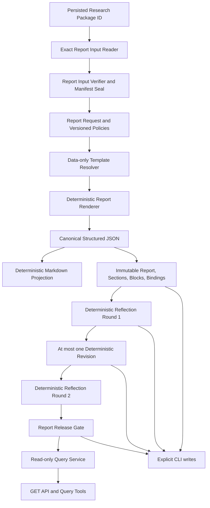

# Stage 8 Verifiable Report and Runtime Reflection Design

- Status: APPROVED
- Date: 2026-07-26
- Required approval phrase: `批准设计并继续实现`
- Baseline branch: `main`
- Baseline commits:
  - `0bbb54c fix: enforce stable line endings for research agent fixtures`
  - `eb906ae feat: add controlled research agent orchestration`
- Baseline migration: `0006_controlled_research_agent`
- Baseline regression record: 1,547 passed, zero failed/errors/skipped/warnings

This is the approved Stage 8 design artifact. The user approved it with the
required phrase and authorized implementation on the dedicated Stage 8 branch.
That approval does not authorize model calls, a merge to `main`, a remote or Draft
PR, public publication, or Stage 9 work.

## 1. Decision summary

Adopt **Route C: controlled hybrid report architecture**, with Route B as the
entire Stage 8 production behavior:

1. `DeterministicReportRenderer` is the only production renderer.
2. The renderer consumes one verified, immutable Stage 7 Research Package input
   manifest. It never resumes research or reads “latest” facts.
3. Structured JSON is the canonical report representation. Markdown is a
   deterministic projection of that same structure.
4. Every factual paragraph, bullet, and metric/evidence table row is bound to an
   exact Claim and then to the Stage 7 Claim-Evidence Link and Evidence.
5. Document statements require the already persisted VALID Citation and exact
   DocumentVersion. Structured statements require the already persisted source or
   Calculation Run lineage.
6. Visible references are stable first-appearance labels:
   `[CIT-001]`, `[EV-001]`, `[MET-001]`, `[LIM-001]`, and `[CON-001]`.
7. Runtime Reflection is a deterministic rules engine, limited to two rounds.
8. Revision is deterministic, limited to one round, and may only delete, downgrade,
   reclassify, disclose, reorder references, or truncate excerpts. It cannot create
   a fact, Claim, Evidence, Citation, calculation, or retrieval result.
9. `ReportReleaseGate` is deterministic and is the only authority that can produce
   an internal `PUBLISHABLE` decision.
10. Narrative and Reflection provider ports exist for future authorization, but
    production model providers are `BLOCKED`; scripted providers are test-only.
11. Industrial FII and Micron reports remain `PARTIAL` or `BLOCKED` while their
    approved company bodies and sufficient financial facts are absent.
12. A neutral Synthetic report may pass the engineering gate only under an
    isolated test policy and must remain visibly marked test-only.

This choice preserves the reproducibility, point-in-time scope, Evidence Ledger,
Citation validity, Tool permissions, and immutable audit trail established in
Stages 4–7.

## 2. Current-state audit

### 2.1 Git and Stage 7 completion

The design audit found:

- branch `main`;
- no tracked, staged, or untracked change before this design artifact;
- Stage 7 squash merge `eb906ae`;
- Stage 7 research-fixture LF fix `0bbb54c`;
- no Stage 8 production module, migration, Tool, API route, CLI command, or test.

The Stage 7 implementation report records:

- deterministic orchestration and Claim validation complete;
- 30 registered metadata/query Tools in the Stage 7 final catalog;
- the Research Run execution allowlist remains the exact 22 Stage 3–6 data and
  evidence Tools;
- eight Stage 7 query Tools are deliberately outside that execution allowlist;
- PostgreSQL head `0006_controlled_research_agent`;
- 1,547 tests passed with no failures, errors, skips, or warnings;
- unresolved `CRITICAL=0` and unresolved `HIGH=0`;
- conclusion `CONDITIONAL GO`.

The Stage 8 post-approval preflight will re-run these checks. The historical report
is not treated as a substitute for that future verification.

### 2.2 Research Package

`ResearchPackageRecord` is immutable and contains:

- Run, Request, Security, Snapshot, as-of, and research type;
- Policy, planner, Tool catalog, evidence, Claim, and Package versions;
- Package status `COMPLETE`, `PARTIAL`, `BLOCKED`, or `FAILED`;
- ten ordered section records with status and Claim IDs;
- Evidence IDs;
- unsupported and conflicting Claim IDs;
- blocked capabilities and warnings;
- a semantic Package checksum.

The assembler:

- maps every Claim to one of ten approved Research sections;
- preserves unsupported and conflicting IDs;
- emits explicit `NOT_REQUESTED`, `NO_EVIDENCE`, `BLOCKED`, or `PARTIAL` states;
- sorts Claim and Evidence IDs deterministically;
- contains no narrative, advice, rating, target price, forecast, or trade.

The `research_packages` table has one row per Run, restrictive foreign keys, a
checksum CHECK, a same-Run/Security/Snapshot/as-of insert trigger, and an immutable
trigger.

### 2.3 Run terminal semantics

Stage 7 Run terminal states are:

- `COMPLETED`
- `PARTIAL`
- `BLOCKED`
- `FAILED`
- `CANCELLED`

Only `COMPLETED`, `PARTIAL`, and `BLOCKED` are eligible Stage 8 inputs. `FAILED` and
`CANCELLED` are auditable but cannot produce a business research report.
Stage 8 never transitions, resumes, or otherwise mutates a Research Agent Run.

### 2.4 Claims and support states

Stage 7 Claims are immutable after validation and use:

- Claim types: identity, financial fact, financial metric, valuation metric,
  document disclosure, corporate action, data quality, and limitation;
- lifecycle: `CANDIDATE`, `VALIDATED`, or `REJECTED`;
- support: `SUPPORTED`, `PARTIALLY_SUPPORTED`, `CONFLICTING`, `UNSUPPORTED`, or
  `BLOCKED`;
- stable `statement_code`;
- Decimal value, unit, currency, period, as-of, and metric basis for numeric Claims;
- builder and validator versions.

Only `ClaimSupportValidator` assigns support. Stage 8 cannot recalculate or change
support:

- `SUPPORTED` may appear as a normal factual statement if all report bindings pass.
- `PARTIALLY_SUPPORTED` must be visibly qualified.
- `CONFLICTING` appears only in the conflicts section and preserves all conflicting
  Evidence.
- `UNSUPPORTED` appears only in the unsupported appendix or limitations.
- `BLOCKED` explains a capability or evidence limit and never proves a company fact.

### 2.5 Evidence and Claim-Evidence Links

Stage 7 Evidence is immutable and bound to one Run, Security, Snapshot, as-of,
Observation, source record, checksum, publication time, synthetic status, and
optional Citation or calculation lineage.

Evidence states are:

- `VALID`
- `INVALID`
- `FUTURE_DATA`
- `SOURCE_MISSING`
- `CONFLICTING`
- `BLOCKED`

Synthetic states are:

- `REAL_VERIFIED`
- `FIXTURE_REAL_EXCERPT`
- `SYNTHETIC_TEST_ONLY`
- `UNKNOWN`

`claim_evidence_links` is immutable, unique by Claim/Evidence pair, and guarded so
both endpoints belong to the same Run. Link roles are `PRIMARY`,
`CORROBORATING`, `CONTRADICTING`, `CONTEXT`, and `LIMITATION`.

The Stage 8 report binding chain must point to this existing link rather than
constructing an independent relationship.

### 2.6 Citation and DocumentVersion

A Citation is bound to an exact immutable DocumentVersion, Parse Run, locator,
excerpt, document checksum, canonical-text checksum, parser version, sanitizer
version, and citation version.

`CitationVerifier` deterministically checks:

- document and locator checksums;
- Parse generation;
- Snapshot membership or exact as-of;
- withdrawn/superseded status;
- known publication time for strict historical use;
- future publication;
- Blob checksum, size, and MIME type;
- locator existence;
- canonical source text;
- exact excerpt.

Only `CitationStatus.VALID` may support a document statement. Stage 8 does not
create, update, or re-verify a Citation by fetching a source. It rechecks the
persisted Citation and its exact local immutable context through an internal
read-only verifier.

### 2.7 Compatibility gap: set checksums

Stage 7 stores a Package checksum and immutable Claim, Evidence, and Link rows, but
the Package row does not contain separate `claim_set_checksum`,
`evidence_set_checksum`, or `link_set_checksum` columns.

Stage 8 must not alter a Stage 7 table. It therefore introduces an immutable
`ReportInputManifest` inside the Report Request:

- reconstruct the exact Claim ID set from all Package sections;
- require every unsupported/conflicting ID to belong to that set;
- require the exact Package Evidence ID set;
- load only Claims, Evidence, and Claim-Evidence Links from the Package Run;
- validate row lineage, source checksums, and Stage 7 immutability constraints;
- calculate canonical Claim, Evidence, Link, and Citation set checksums;
- persist those expected checksums with the Report Request and Generation Run;
- re-read by exact IDs and revalidate the same checksums before generation,
  Reflection, Revision, and Gate.

This does not pretend that the original Stage 7 Package stored fields it did not
store. It creates the first Stage 8 report-input seal over already immutable rows.
Any mismatch after sealing is a blocking `STALE_PACKAGE` or `CHECKSUM_MISMATCH`
finding.

### 2.8 Issuer identity

`ResearchPackageRecord` has `security_id` but not `issuer_id`. Stage 8 obtains
issuer identity only from the Package-bound, validated
`SECURITY_MASTER_EVIDENCE`; it does not read a current Security or Issuer row to
invent report content. The internal adapter may cross-check the referenced master
row for referential integrity, but the frozen Evidence payload is the report source.
Missing or inconsistent issuer identity blocks normal report generation.

### 2.9 Tool, API, and CLI boundaries

The current Registry has 30 metadata/query Tools:

- 22 Stage 3–6 data/evidence Tools;
- eight Stage 7 Research Run query Tools.

All are `READ_ONLY`, `writes=false`, and `requires_network=false`. Stage 7 API
business endpoints are GET-only. Stage 7 write/control operations are explicit CLI
or internal service operations.

Stage 8 preserves two catalog boundaries:

1. the Stage 7 Research execution catalog remains the exact 22-Tool snapshot and
   checksum;
2. Stage 8 adds a separate ten-Tool report query catalog and a new final metadata
   manifest without automatically adding those Tools to any Research Policy.

No report Tool or GET endpoint can generate, reflect, revise, release-check,
resume research, invoke a Tool, or call a model.

### 2.10 Fixtures and line endings

`.gitattributes` already pins LF for:

- provider JSON fixtures;
- RAG text/HTML/JSON fixtures;
- Research Agent JSON fixtures.

The Stage 7 Synthetic fixture carries:

- `SYNTHETIC_TEST_ONLY`
- `NOT_COMPANY_EVIDENCE`
- `OFFLINE`
- `NOT_LIVE`

If Stage 8 implementation creates `tests/fixtures/reports/*.json` and `*.md`, only
those actual extensions receive exact `text eol=lf` rules. No global Git setting,
repository-wide renormalization, or manifest-hash adjustment may hide a byte
mismatch.

## 3. Route comparison

| Criterion | Route A: model-direct report | Route B: deterministic template | Route C: controlled hybrid |
|---|---|---|---|
| Production renderer now | unavailable model | deterministic | deterministic |
| Claim binding | prompt-dependent | mandatory code rule | mandatory code rule |
| Citation validity | model may fabricate | exact persisted Citation | exact persisted Citation |
| Reflection authority | model self-review | deterministic rules | deterministic rules |
| Release authority | unsafe/model-dependent | deterministic Gate | deterministic Gate |
| Reproducibility | low | high | high in current configuration |
| Offline testing | unreliable | complete | complete |
| Synthetic isolation | prompt-dependent | enforced | enforced |
| Future prose flexibility | high but unsafe | limited | bounded candidate provider |
| Current fit | rejected | safe | recommended |

### 3.1 Route A rejection

Route A cannot be the default because:

- no production Model Provider exists;
- a model cannot guarantee sentence-to-Claim binding;
- it may add unsupported statements or fabricated Citations;
- it may hide `PARTIAL`, `BLOCKED`, `CONFLICTING`, and `UNSUPPORTED`;
- it may turn Synthetic test data into real-company prose;
- it is not stably reproducible or fully testable offline;
- it may leak ratings, target prices, recommendations, or trade instructions;
- model self-Reflection cannot be the release authority.

### 3.2 Route B trade-off

Route B is sufficient for all Stage 8 production acceptance:

- exact inputs;
- data-only templates;
- deterministic JSON and Markdown;
- mandatory bindings;
- static Reflection rules;
- deterministic Revision and Gate;
- no model, network, Tool, or latest-data access.

Its limitation is deliberately modest prose and a closed set of statement
templates.

### 3.3 Route C recommendation

Route C uses Route B unchanged for production and adds future-safe provider ports.
A future Narrative Provider may only propose bounded candidate blocks already
declaring exact Claim IDs. A future Reflection Provider may only propose candidate
findings. Deterministic validators must independently reconstruct every binding,
reject unbound text, and apply the authoritative rules. Providers can never:

- execute a Tool;
- alter Package, Claim, Evidence, Citation, Security, Snapshot, or as-of;
- create a Citation;
- set Claim support;
- decide a Release Gate;
- increase rounds or budgets.

This is the recommended architecture because it preserves current safety while
avoiding a future rewrite of the provider boundary.

## 4. Layered architecture



The layers are deliberately separate:

1. input reading and verification;
2. immutable policy and template selection;
3. report rendering;
4. binding validation and visible-reference allocation;
5. persistence;
6. deterministic runtime Reflection;
7. deterministic Revision;
8. deterministic Release Gate;
9. read-only projections;
10. explicit CLI composition.

No layer is allowed to reach backward into data ingestion, Tool execution,
financial calculation, retrieval, or Research Agent orchestration.

## 5. Stable versions and production defaults

| Contract | Stage 8 version |
|---|---|
| Report input manifest | `report-input-manifest-v1` |
| Report Policy | `verifiable-report-policy-v1` |
| Runtime Reflection Policy | `runtime-report-reflection-v1` |
| Template schema | `report-template-v1` |
| zh-CN templates | `1.0.0` |
| en-US templates | `1.0.0` |
| Renderer | `deterministic-report-renderer-v1` |
| Structured report schema | `research-report-v1` |
| Markdown renderer | `deterministic-markdown-v1` |
| Reference allocator | `report-reference-allocator-v1` |
| Reflection engine | `deterministic-report-reflection-v1` |
| Revision engine | `deterministic-report-revision-v1` |
| Release Gate | `report-release-gate-v1` |

Default locale is `zh-CN`. `en-US` is the only other locale. Defaults are fixed
literal versions, not “latest” lookups.

## 6. Package input contract

### 6.1 Internal read port

```python
class ReportInputRepository(Protocol):
    def get_package_bundle(
        self,
        research_package_id: UUID,
    ) -> PersistedReportInput | None: ...


class ReportInputVerifier:
    def verify(
        self,
        bundle: PersistedReportInput,
    ) -> VerifiedReportInput: ...
```

`PersistedReportInput` contains exact persisted records:

- Research Package, Research Agent Run, and Research Request;
- all Package Claim IDs and Claim rows;
- all Package Evidence IDs and Evidence rows;
- all Claim-Evidence Links needed by those Claims;
- exact Citation anchors and DocumentVersion metadata referenced by Evidence;
- exact Calculation Run/Input and formula lineage summaries referenced by Evidence;
- Package-bound security/issuer identity Evidence.

The repository uses parameterized queries and exact IDs. It has no method for latest
Snapshot, latest fact, provider refresh, Tool invocation, retrieval, calculation,
or model access.

### 6.2 Verification order

The verifier fails closed in this order:

1. Package exists.
2. Run and Request exist.
3. Run is `COMPLETED`, `PARTIAL`, or `BLOCKED`.
4. Package is not `FAILED`.
5. Package Run/Request/Security/Snapshot/as-of match exactly.
6. Package checksum is recomputed with the Stage 7 canonical algorithm.
7. Section Claim IDs are unique and belong to the Package Run.
8. unsupported/conflicting IDs are members of the section Claim set and have the
   matching support status.
9. Evidence IDs are unique and belong to the Package Run/Security/Snapshot/as-of.
10. every reportable Claim is `VALIDATED`.
11. Claim-Evidence Links match their Claim and Evidence and stay within one Run.
12. source checksums, Citation IDs, and calculation lineage references exist.
13. synthetic status is explicit.
14. issuer identity is present in validated Package Evidence.
15. canonical Claim, Evidence, Link, and Citation set checksums are calculated.

The result is an immutable `VerifiedReportInput` and `ReportInputManifest`. The
manifest stores:

- Package, Claim set, Evidence set, Link set, Citation set, and lineage set
  checksums;
- ordered exact IDs;
- Run, Request, Security, Issuer, Snapshot, as-of, research type, and Package
  status;
- Stage 7 Policy, planner, Tool catalog, Claim, Evidence, and Package versions;
- synthetic/research mode;
- warnings, blocked capabilities, section states, data quality, and limitations.

Every later Stage 8 write service calls `ReportInputVerifier.revalidate(manifest)`
before it writes. A mismatch never causes a fallback to current data.

## 7. Report Request

`ReportRequestRecord` is immutable and contains:

- `id`;
- `research_package_id`;
- `report_type`;
- `report_locale`;
- `template_name` and exact `template_version`;
- exact `report_policy_version` and `reflection_policy_version`;
- ordered allowlisted `requested_sections`;
- `include_evidence_appendix`;
- `include_claim_index`;
- `max_excerpt_length`;
- `package_checksum`, `claims_checksum`, `evidence_checksum`,
  `links_checksum`, and `citations_checksum`;
- `idempotency_key`;
- `created_at`.

Report types:

- `DATA_QUALITY_REPORT`
- `EVIDENCE_SUMMARY`
- `FINANCIAL_RESEARCH_DRAFT`
- `FULL_RESEARCH_DRAFT`

`FULL_RESEARCH_DRAFT` is an evidence-constrained structured draft, not a published
investment report.

Rules:

- `BLOCKED` Package: only `DATA_QUALITY_REPORT`;
- `PARTIAL` Package: allowed types are policy-controlled and always retain PARTIAL
  disclosure;
- locale: only `zh-CN` or `en-US`, default fixed to `zh-CN`;
- sections: exact enum allowlist;
- no template path, expression, script, URL, filesystem path, SQL, provider, model,
  or arbitrary output path;
- caller options may reduce excerpt length and sections, never expand Policy.

The request idempotency key hashes all semantic fields and the entire input manifest
checksum.

## 8. Report Policy

`ReportPolicyRecord` is immutable, versioned, checksummed, and explicitly seeded by
CLI/internal service after approval. Migration inserts no policy rows.

Default `verifiable-report-policy-v1`:

- allowed report types: all four, subject to Package-state rules;
- allowed locales: `zh-CN`, `en-US`;
- allowed sections: the closed Stage 8 section enum;
- `include_unsupported_claims=true`;
- `include_conflicting_claims=true`;
- `include_blocked_capabilities=true`;
- `include_data_quality=true`;
- `include_limitations=true`;
- `require_claim_binding=true`;
- `require_evidence_binding=true`;
- `require_valid_document_citation=true`;
- `allow_synthetic_evidence=false`;
- `allow_unknown_published_at=false`;
- `max_report_blocks=300`;
- `max_claims_per_block=20`;
- `max_citations_per_block=20`;
- `max_excerpt_length=1000`;
- `max_reflection_rounds=2`;
- `max_revision_rounds=1`;
- `allow_model_narrative=false`;
- `allow_model_reflection=false`.

Unsupported Claims are visible only in the unsupported appendix or limitations.
Conflicting Claims are visible only in the conflicts section. A new policy version
is required for any change; existing Report Requests retain the old version.

## 9. Runtime Reflection Policy

`RuntimeReflectionPolicyRecord` is separate from development Reflection documents.
It is immutable, versioned, checksummed, and explicitly seeded.

Default `runtime-report-reflection-v1`:

- exact closed required-check list from section 20;
- `severity_threshold=HIGH`;
- `max_reflection_rounds=2`;
- `max_revision_rounds=1`;
- `allow_model_reflection=false`;
- `require_release_gate=true`.

Report Policy and Runtime Reflection Policy must agree on round limits. A mismatch
blocks Request creation rather than silently selecting a larger value.

## 10. Data-only Report Template Version

`ReportTemplateVersionRecord` contains:

- ID, name, semantic version, report type, locale;
- ordered section keys;
- closed section rules;
- closed statement-code-to-pattern mappings;
- closed table column descriptors;
- citation style;
- template schema version;
- checksum;
- status `ACTIVE`, `DEPRECATED`, or `TEST_ONLY`;
- creation time.

Templates are strict Pydantic data. They are not Jinja, Python format strings,
callables, source code, AST, expressions, or files. A sentence pattern is a tuple of
literal localized label tokens and a closed placeholder enum such as:

- `OFFICIAL_SECURITY_NAME`
- `SYMBOL`
- `EXCHANGE`
- `CLAIM_VALUE`
- `CLAIM_UNIT`
- `CLAIM_PERIOD`
- `CLAIM_AS_OF`
- `VISIBLE_REFERENCE`

The renderer resolves each placeholder from a typed object. Unknown placeholders,
unknown statement codes, arbitrary attribute traversal, and executable syntax are
rejected.

Production defaults are fixed by `(report_type, locale, template_version)`.
`TEST_ONLY` templates cannot be selected in production. Identical template content
must have the same checksum.

## 11. Provider ports

```python
class NarrativeProvider(Protocol):
    @property
    def metadata(self) -> NarrativeProviderMetadata: ...

    def validate_configuration(self) -> ProviderHealth: ...

    def render_candidate_blocks(
        self,
        context: ReportRenderContext,
    ) -> tuple[CandidateReportBlock, ...]: ...


class ReflectionProvider(Protocol):
    @property
    def metadata(self) -> ReflectionProviderMetadata: ...

    def validate_configuration(self) -> ProviderHealth: ...

    def propose_findings(
        self,
        context: ReportReflectionContext,
    ) -> tuple[CandidateReflectionFinding, ...]: ...
```

Production composition:

- deterministic renderer: `READY`;
- deterministic Reflection engine: `READY`;
- model Narrative Provider: `BLOCKED`;
- model Reflection Provider: `BLOCKED`;
- model token budget and consumption: zero;
- no environment key can auto-enable a provider.

Scripted providers live only under `tests/support`, are marked `TEST_ONLY` and
`NOT_PRODUCTION`, and are not imported by production factories.

A `CandidateReportBlock` must declare existing exact Claim IDs. The deterministic
binding validator rebuilds the complete Claim/Evidence/Citation chain and rejects
unbound text. A candidate finding is independently re-evaluated by the deterministic
rules. Provider output never controls support or release.

## 12. Report Generation Run

`ReportGenerationRun` status transitions:

| Current | Allowed next |
|---|---|
| `CREATED` | `RUNNING` |
| `RUNNING` | `COMPLETED`, `PARTIAL`, `BLOCKED`, `FAILED` |
| terminal | none |

The row stores:

- Report Request, Package, Run, Security, Snapshot, and as-of;
- exact Policy, template, renderer, locale, and input manifest versions/checksums;
- idempotency key;
- start/completion timestamps;
- warning count;
- bounded blocked reason, error code, and safe error message.

An active or successful identical run converges through a unique idempotency index.
`FAILED` cannot masquerade as success. A change to Package, Claim/Evidence/Link
sets, Policy, template, renderer, locale, or requested sections produces a distinct
key.

Generation status describes generation outcome:

- `COMPLETED`: a complete input produced an initial candidate;
- `PARTIAL`: a partial input produced an honestly partial candidate;
- `BLOCKED`: only a bounded data-quality/limitation report was possible;
- `FAILED`: invariant or internal processing failure.

Terminal rows are immutable and cannot read current data later.

## 13. Canonical Research Report

### 13.1 Report versions

`ResearchReport` is immutable and contains:

- Generation Run and monotonic `report_version`;
- `previous_report_id`;
- report type and locale;
- status `DRAFT`, `REFLECTED`, `REVISED`, `PUBLISHABLE`, `PARTIAL`, `BLOCKED`, or
  `FAILED`;
- title and subtitle;
- Security, Snapshot, and as-of;
- Package/input checksums;
- canonical `structured_content`;
- deterministic `markdown_content`;
- `structured_checksum`, `markdown_checksum`, and combined `content_checksum`;
- Claim, Evidence, Link, and Citation set checksums;
- renderer/template versions and creation time.

Initial complete reports are `DRAFT`; initial partial or blocked reports remain
`PARTIAL` or `BLOCKED`. A revision creates `REVISED`. The release service may create
a content-identical sealed `PUBLISHABLE` successor only after a PUBLISHABLE Gate
decision. A content-identical `REFLECTED` checkpoint is permitted only when no
revision occurred and a second-round audit needs an immutable candidate seal; it is
not created merely to increase version count.

The Gate decision remains the authoritative release state. No report is actually
sent, uploaded, or publicly published.

### 13.2 Version-chain rules

- one initial Report per Generation Run;
- one target Report per Revision Run;
- one parent except version 1;
- parent belongs to the same Generation Run;
- child version equals parent version plus one;
- no self-reference or cycle;
- old versions remain queryable;
- Revision copies and transforms immutable blocks into new rows;
- no in-place content update;
- PUBLISHABLE seal cannot change content from the gated candidate.

### 13.3 Canonical JSON and Markdown

Canonical JSON uses:

- sorted object keys;
- UTF-8;
- Unicode NFKC for controlled template literals and labels;
- UTC `Z` datetimes;
- UUID strings;
- Decimal strings;
- stable section/block/reference order;
- no database audit timestamps or generated row UUIDs in semantic checksums.

Markdown is rendered exclusively from canonical structured content. It uses LF and
one trailing newline. Raw HTML is disabled and Markdown control characters in
source labels/excerpts are escaped. Markdown is never parsed back to establish
facts.

The combined checksum hashes schema version, structured checksum, Markdown checksum,
template/renderer/locale, input manifest checksum, and visible-reference map.

## 14. Sections and blocks

### 14.1 Sections

Closed section keys:

- `RESEARCH_SCOPE`
- `SECURITY_IDENTITY`
- `DATA_AVAILABILITY`
- `FINANCIAL_HEALTH`
- `VALUATION_SNAPSHOT`
- `DOCUMENT_EVIDENCE`
- `CATALYST_EVIDENCE`
- `RISK_EVIDENCE`
- `CORPORATE_ACTIONS`
- `DATA_QUALITY`
- `CONFLICTS`
- `UNSUPPORTED_CLAIMS`
- `LIMITATIONS`
- `CLAIM_INDEX`
- `EVIDENCE_APPENDIX`
- `CITATION_APPENDIX`

Section statuses:

- `COMPLETE`
- `PARTIAL`
- `BLOCKED`
- `NO_EVIDENCE`
- `NOT_REQUESTED`

Template controls exact order. `DATA_QUALITY` and `LIMITATIONS` are mandatory. Empty
sections use explicit state blocks and cannot contain fabricated prose.

### 14.2 Blocks

Block types:

- `HEADING`
- `PARAGRAPH`
- `BULLET_LIST`
- `METRIC_TABLE`
- `EVIDENCE_TABLE`
- `WARNING`
- `LIMITATION`
- `CONFLICT`
- `CLAIM_INDEX`
- `CITATION_LIST`

A block has a stable semantic `block_key`, index, type, status, localized text or
bounded structured payload, and checksum.

To keep binding deterministic:

- one factual paragraph contains one templated factual statement;
- every factual bullet has a stable item key;
- every metric/evidence table row has a stable row key;
- Claim bindings point to sentence index, bullet item key, or table row key;
- headings need no Claim;
- warning/limitation blocks bind an existing Claim, Evidence, Package state,
  warning, or blocked capability;
- arbitrary free-form factual text is invalid.

## 15. Claim, Evidence, and Citation bindings

### 15.1 Claim binding

`ReportClaimBinding` contains:

- Report Block and Claim IDs;
- role `PRIMARY`, `SUPPORTING`, `CONTRADICTING`, or `LIMITATION`;
- exact `sentence_index` or stable `item_or_row_key`;
- creation time.

Rules:

- unique Block/Claim/location;
- normal factual blocks require a `PRIMARY` `SUPPORTED` Claim;
- `PARTIALLY_SUPPORTED` may be primary only in an explicitly qualified PARTIAL
  block;
- `CONFLICTING` only in `CONFLICT`;
- `UNSUPPORTED` only in `UNSUPPORTED_CLAIMS` or `LIMITATION`;
- `BLOCKED` only explains limitations;
- real-company normal sections reject synthetic/unknown Claims.

### 15.2 Evidence binding

`ReportEvidenceBinding` contains:

- Report Block;
- Report Claim Binding;
- exact existing `claim_evidence_link_id`;
- exact Evidence ID;
- binding role and visible reference kind;
- stable `item_or_row_key`;
- creation time.

A trigger and domain validator require:

- the Stage 7 link joins exactly the bound Claim and Evidence;
- Claim and Evidence belong to the Package Run;
- Security/Snapshot/as-of match the Report;
- primary factual Evidence is `VALID`;
- Evidence is present in the input manifest;
- synthetic/unknown evidence is forbidden in real-company normal sections.

### 15.3 Citation binding

`ReportCitationBinding` contains:

- Report Evidence Binding;
- Citation and DocumentVersion IDs;
- visible reference;
- locator summary;
- bounded rendered excerpt and its checksum;
- Citation status captured as `VALID`;
- creation time.

The binding is permitted only when Stage 7 document Evidence points to that exact
Citation and the internal verifier returns VALID under the Report Snapshot/as-of.
It cannot replace the Citation ID or create a new anchor.

### 15.4 Structured lineage

Structured fact Evidence may use `[EV-nnn]`. Derived metrics use `[MET-nnn]` and
must retain:

- Calculation Run ID;
- non-empty Calculation Input IDs;
- Formula version;
- metric/fact code;
- Decimal value;
- unit and currency if applicable;
- period and as-of;
- Snapshot match.

Stage 8 never calculates, rounds without a declared formatting rule, converts
currency, or writes a financial fact.

## 16. Stable visible references

The reference allocator traverses:

1. Template section order;
2. block index;
3. sentence/bullet/table-row location;
4. Claim binding role and Claim stable key;
5. Evidence role and stable source identity.

On first appearance it assigns:

- document Citation: `[CIT-001]`;
- structured fact Evidence: `[EV-001]`;
- metric lineage: `[MET-001]`;
- limitation: `[LIM-001]`;
- conflict: `[CON-001]`.

The same internal Citation or Evidence reuses its label. User-visible numbering does
not use UUID order. UUIDs remain in structured appendices and persistence.

The allocator validates a bijection:

- every body reference has one appendix entry;
- every appendix reference appears in the body or required index;
- duplicate labels cannot point to different records;
- one record cannot receive multiple labels of the same kind.

Reference order is recalculated from scratch after a revision, then all Report
bindings are copied into the new version with the new deterministic labels.

## 17. Deterministic rendering and localization

`DeterministicReportRenderer.render`:

```python
class DeterministicReportRenderer:
    def render(
        self,
        report_input: VerifiedReportInput,
        request: ReportRequestRecord,
        policy: ReportPolicyRecord,
        template: ReportTemplateVersionRecord,
    ) -> RenderedReportDraft: ...
```

Fixed behavior:

1. revalidate input manifest;
2. validate Package-state/report-type compatibility;
3. select the exact template version;
4. classify Claims by support state and section;
5. build only allowlisted statement patterns;
6. validate the Claim→Link→Evidence→Citation/lineage chain;
7. allocate visible references;
8. build appendices and indexes;
9. serialize canonical structured content;
10. render Markdown from that content;
11. compute checksums;
12. return an immutable draft for transactional persistence.

It does not call a model, Tool, provider, network, filesystem, environment, or
latest-data query.

Localization rules:

- template labels and fixed qualifying phrases are localized;
- company legal/display names and symbols remain exact;
- source excerpts remain in their original language;
- no excerpt is machine-translated or represented as company-authored translation;
- dates use `YYYY-MM-DD` and UTC timestamps use RFC 3339;
- Decimal values remain strings;
- CNY remains CNY and USD remains USD;
- no automatic FX conversion;
- source-supported precision is preserved;
- `N/M`, `NULL`, `ZERO`, `BLOCKED`, TTM method, A-share cumulative-period basis, and
  U.S. non-calendar fiscal-year basis remain explicit;
- missing values never become zero.

The renderer has a closed forbidden-language vocabulary for ratings, target prices,
recommendations, position sizing, trading commands, and unsupported absolutes or
promotional adjectives in both locales.

## 18. Runtime Reflection

### 18.1 Reflection Run

`ReportReflectionRun` contains:

- exact Report and Reflection Policy;
- deterministic engine name/version;
- round 1 or 2;
- status `RUNNING`, `PASS`, `FINDINGS`, `BLOCKED`, or `FAILED`;
- start/completion timestamps;
- total and severity counts;
- input Report checksum.

Unique `(research_report_id, reflection_policy_version, round_number)` prevents
duplicate same-round runs. A terminal run is immutable. Reflection never edits any
Report, Claim, Evidence, Citation, Package, or Research Run.

Round semantics:

- Round 1 applies to the initial report.
- If revision occurs, Round 2 applies to the revision target.
- If no revision is needed, Round 2 re-evaluates the same content or its
  content-identical reflected seal.
- no round 3 exists.

### 18.2 Findings

Each immutable `ReportReflectionFinding` stores:

- finding code and closed category;
- severity `CRITICAL`, `HIGH`, `MEDIUM`, or `LOW`;
- Report/Section/Block and optional Claim/Evidence/Citation;
- bounded localized-neutral description and remediation code;
- blocking flag;
- creation time.

Descriptions never copy full documents, secrets, SQL, local paths, or stack traces.
Findings are not updated to “fixed”; the Revision Run records applied Finding IDs,
and Round 2 independently proves whether the issue remains.

### 18.3 Deterministic checks

The engine performs all required checks:

1. factual block has a Claim;
2. primary Claim has Evidence;
3. document Claim has a VALID Citation;
4. structured Claim has source/Calculation lineage;
5. Security matches;
6. Snapshot matches;
7. as-of matches;
8. no future Evidence;
9. no unknown publication time for strict document statements;
10. no synthetic/unknown real-company evidence;
11. no cross-Security records;
12. no cross-Snapshot records;
13. every conflicting Claim is disclosed;
14. partial support uses qualified language;
15. unsupported Claims stay out of normal sections;
16. blocked capabilities are not described as completed;
17. Data Quality exists;
18. Limitations exists;
19. no orphan body reference;
20. no unused appendix reference;
21. Citation remains valid;
22. Claim set checksum matches;
23. Evidence/Link set checksums match;
24. Package checksum matches;
25. no rating language;
26. no target price;
27. no position advice;
28. no trading instruction;
29. no unsupported overstated language;
30. Fixture is not described as Live;
31. Synthetic is not described as real-company research;
32. excerpts stay within Policy;
33. unit and currency match;
34. report as-of is present;
35. Snapshot identity is present;
36. no nonexistent model call is claimed;
37. blocked Vector/partial Hybrid is not described as full semantic retrieval;
38. structured JSON and Markdown checksums agree;
39. Report structure and version chain are valid;
40. Report input manifest has not changed.

Severity defaults:

- `CRITICAL`: checksum/stale input, cross-Security/Snapshot, future data, synthetic
  contamination, forbidden recommendation/target/trading content;
- `HIGH`: missing Claim/Evidence binding, invalid Citation, unsupported body fact,
  hidden conflict, missing mandatory Data Quality/Limitations;
- `MEDIUM`: partial-support phrasing, orphan/duplicate reference, unit/period display
  inconsistency, overlong excerpt;
- `LOW`: non-factual deterministic formatting defect.

Any policy override that would lower these minimum severities is rejected.

## 19. Deterministic Revision

```python
class DeterministicReportRevisionEngine:
    def revise(
        self,
        source: ResearchReportAggregate,
        reflection: ReportReflectionResult,
        policy: ReportPolicyRecord,
    ) -> ReportRevisionDraft: ...
```

Allowed action codes:

- `DELETE_UNBOUND_FACT_BLOCK`
- `DELETE_UNSUPPORTED_FACT_BLOCK`
- `DOWNGRADE_PARTIAL_LANGUAGE`
- `MOVE_CONFLICT_TO_CONFLICTS`
- `MOVE_UNSUPPORTED_TO_APPENDIX`
- `MOVE_BLOCKED_TO_LIMITATIONS`
- `ADD_DATA_QUALITY_FROM_EXISTING_STATE`
- `ADD_LIMITATIONS_FROM_EXISTING_STATE`
- `RENUMBER_EXISTING_REFERENCES`
- `REMOVE_INVALID_CITATION_BLOCK`
- `REMOVE_FORBIDDEN_ADVICE_TEXT`
- `TRUNCATE_EXISTING_EXCERPT`
- `FIX_DETERMINISTIC_FORMAT`

The engine may only transform existing report state or render a limitation already
present in Package warnings, blocked capabilities, data-quality Claims, or
Reflection findings. It cannot:

- create or modify a Stage 7 Claim, Evidence, Link, Citation, source fact, or
  calculation;
- introduce a new business statement;
- change Security, Snapshot, issuer, or as-of;
- translate an excerpt;
- convert currency;
- resolve a conflict;
- call a Tool/model/network;
- increase rounds or create a child workflow.

`ReportRevisionRun` stores:

- source Report and source Reflection Run;
- target Report;
- engine name/version and `revision_round=1`;
- status `RUNNING`, `COMPLETED`, `PARTIAL`, `BLOCKED`, or `FAILED`;
- applied and unresolved Finding IDs;
- exact action records;
- start/completion times.

One source Report may have at most one Stage 8 revision. One Revision Run has at
most one target Report. Terminal rows are immutable.

## 20. Fixed runtime workflow

The only allowed sequence is:

```text
Verified Research Package
→ Generate Initial Report
→ Reflection Round 1
→ Deterministic Revision (zero or one)
→ Reflection Round 2
→ Report Release Gate
```

Guards:

- maximum Reflection rounds: 2;
- maximum Revision rounds: 1;
- no recursion;
- no retry-until-pass;
- no child Report Generation Run to evade findings;
- no Policy replacement mid-run;
- no automatic Package/Research rerun;
- consumed round counts never reset;
- each explicit CLI step validates its predecessor.

## 21. Report Release Gate

`ReportReleaseGate.evaluate` is a pure deterministic decision followed by one
transactional audit write.

Decisions:

- `PUBLISHABLE`
- `PARTIAL`
- `BLOCKED`
- `FAILED`

The Gate record stores:

- candidate Report;
- optional sealed PUBLISHABLE Report;
- Round 2 Reflection Run;
- Gate engine version;
- input and report checksums;
- decision;
- sorted reason codes;
- evaluated time.

Exactly one authoritative Gate exists per candidate Report and Gate version.
Conflicting decisions are prohibited.

`PUBLISHABLE` requires:

- valid Report and Package/input checksums;
- completed Round 2;
- no `CRITICAL` or `HIGH` finding;
- no unsupported factual body Claim;
- every conflict disclosed;
- every document statement has a VALID Citation;
- every structured statement has valid lineage;
- no future or unknown strict Evidence;
- no synthetic contamination;
- no Security/Snapshot/as-of mismatch;
- no advice, rating, target, position, or trade content;
- mandatory Data Quality and Limitations;
- Package not `PARTIAL` or `BLOCKED`;
- Report type compatible with Package state.

`PARTIAL` requires:

- Package `PARTIAL`;
- only supported or explicitly qualified partially-supported factual Claims;
- all limits and conflicts disclosed;
- no critical/high findings.

`BLOCKED` applies to:

- Package `BLOCKED`;
- insufficient evidence for normal factual sections;
- unresolved critical/high finding;
- invalid Citation;
- future data;
- synthetic contamination;
- cross-Security/Snapshot/as-of input.

`FAILED` is reserved for invalid workflow state or internal invariant failure, not
missing business evidence.

A PUBLISHABLE decision creates an immutable content-identical sealed successor with
status `PUBLISHABLE`; this is an internal release-ready state only. No external
publication occurs.

## 22. Honest Package degradation

### 22.1 BLOCKED Package

A BLOCKED Package may generate only `DATA_QUALITY_REPORT`. It contains:

- research scope and exact identifiers;
- Package state;
- data availability;
- blocked capabilities;
- data quality;
- limitations;
- unsupported/conflict indexes if present.

Normal company facts, full research sections, ratings, target prices, forecasts, and
recommendations are absent. Gate decision is `BLOCKED`.

### 22.2 PARTIAL Package

A PARTIAL Package may generate an allowed draft only when:

- every included fact is supported or explicitly partially supported;
- missing sections remain PARTIAL/BLOCKED/NO_EVIDENCE;
- conflicts, unsupported Claims, blocked capabilities, data quality, and
  limitations remain visible.

Gate decision is `PARTIAL`, never PUBLISHABLE.

### 22.3 COMPLETE Package

A COMPLETE Package may become internally PUBLISHABLE only after both Reflection
rounds and all Gate rules. Completion alone is never sufficient.

## 23. Real-company and Synthetic acceptance

### 23.1 Industrial FII (`601138.SH`)

Use the current persisted real Package only. Expected:

- exact Security, Snapshot, as-of, and Package state;
- no approved company body remains BLOCKED/NO_EVIDENCE;
- insufficient financial evidence remains PARTIAL/BLOCKED;
- no AI-server, order-growth, or profit-improvement statement without an existing
  validated Claim and Evidence;
- no synthetic content;
- Data Quality and Limitations present;
- every factual block bound;
- Gate `PARTIAL` or `BLOCKED`;
- never a PUBLISHABLE complete company report.

### 23.2 Micron (`MU`)

Use the current persisted real Package only. Expected:

- exact Security/CIK identity, Snapshot, and as-of;
- SEC metadata is not a 10-K/10-Q/8-K body;
- document section BLOCKED without saved filing body;
- no HBM-demand, inventory-cycle, data-center-revenue, or risk-factor conclusion
  without an existing supported Claim;
- no synthetic content;
- Data Quality and Limitations present;
- Gate `PARTIAL` or `BLOCKED`;
- never a disguised complete Micron report.

### 23.3 Synthetic engineering report

Use a neutral Synthetic Security and isolated test Policy/template. Every layer
retains:

- `SYNTHETIC_TEST_ONLY`
- `NOT_COMPANY_EVIDENCE`
- `OFFLINE`
- `NOT_LIVE`

It may validate a PUBLISHABLE Gate, bilingual rendering, references, Reflection,
Revision, checksums, and idempotency. The final structured report, Markdown, API,
CLI, fixtures, and stage report must call it test-only. It cannot share Industrial
FII or Micron IDs and cannot support a real-company report.

## 24. PostgreSQL model

Use exactly 15 Stage 8 tables:

1. `report_policies`
2. `report_template_versions`
3. `runtime_reflection_policies`
4. `report_requests`
5. `report_generation_runs`
6. `research_reports`
7. `report_sections`
8. `report_blocks`
9. `report_claim_bindings`
10. `report_evidence_bindings`
11. `report_citation_bindings`
12. `report_reflection_runs`
13. `report_reflection_findings`
14. `report_revision_runs`
15. `report_release_gates`

The input manifest is stored as bounded immutable fields/JSON in `report_requests`
rather than a sixteenth table because there is one manifest per Request and no
independent query lifecycle. This avoids an unnecessary join while keeping all
expected checksums auditable.

All tables use UUID primary keys, aware UTC timestamps, named constraints,
SQLAlchemy 2.x typed mappings, PostgreSQL JSONB only for bounded schema-validated
payloads, and `RESTRICT` foreign keys.

### 24.1 Foreign-key boundaries

Stage 8 references but never mutates:

- `research_packages`;
- `research_agent_runs`;
- `research_requests`;
- `securities`;
- `data_snapshots`;
- `research_claims`;
- `research_evidence`;
- `claim_evidence_links`;
- `citation_anchors`;
- `document_versions`;
- `calculation_runs`.

No Stage 2–7 table definition, row, trigger, Snapshot, Calculation Run, Retrieval
Run, Research Run, Claim, Evidence, or Citation is changed.

### 24.2 Database guards

Migration `0007_create_verifiable_reports_and_reflection` will add:

- immutable Policy, template, Request, Report, Section, Block, binding, completed
  Reflection/Finding, completed Revision, and Gate guards;
- legal Generation/Reflection/Revision status-transition guards;
- terminal immutability;
- Report parent-chain same-Run/version validation and cycle prevention;
- same-Report Section/Block/binding lineage;
- Claim→Link→Evidence match validation;
- Citation→Evidence→DocumentVersion match validation;
- Security/Snapshot/as-of consistency with Package/Run;
- Reflection round in 1–2 and unique same-report round;
- Revision round exactly 1 and one target;
- one non-conflicting Gate per candidate/version;
- PUBLISHABLE sealed-report checksum equality.

Migration creates schema only. It seeds no policy/template, generates no Report,
runs no Reflection, calls no Tool/model/network, and reads no secret.

### 24.3 Status storage

Use string columns with CHECK constraints, not PostgreSQL native ENUMs. Application
enums and migration CHECK values are tested for exact parity.

## 25. Index design

| Index | Query or integrity purpose |
|---|---|
| Request `research_package_id` | list/report requests for exact Package |
| unique Request `idempotency_key` | concurrent identical request convergence |
| unique active/successful Generation `idempotency_key` | prevent duplicate generation |
| Generation `research_package_id` | Package report history |
| Report `(report_generation_run_id, report_version)` unique | stable version list |
| Report `previous_report_id` unique where non-null | one linear successor in v1 |
| Report `(security_id, snapshot_id, created_at)` | bounded report history |
| Section `(research_report_id, section_index)` unique | deterministic section read |
| Block `(report_section_id, block_index)` unique | deterministic block read |
| Claim binding `report_block_id` | block traceability |
| Claim binding `claim_id` | Claim-to-report reverse lookup |
| Evidence binding `report_block_id` | block Evidence lookup |
| Evidence binding `evidence_id` | Evidence-to-report reverse lookup |
| Citation binding `report_block_id` | block Citation lookup |
| Citation binding `citation_id` | Citation-to-report reverse lookup |
| Reflection `(research_report_id, round_number, policy)` unique | one same-round audit |
| Finding `(report_reflection_run_id, severity)` | bounded severity listing |
| Revision `source_report_id` unique | at most one revision |
| Revision `target_report_id` unique | one target ownership |
| Gate `(candidate_report_id, gate_version)` unique | one authoritative decision |
| Gate `sealed_report_id` unique where non-null | one release seal |

No B-tree index is added to Markdown, excerpts, or arbitrary JSON.

## 26. Repository and transaction boundaries

Domain protocols:

- `ReportInputRepository`
- `ReportPolicyRepository`
- `ReportTemplateRepository`
- `ReportRequestRepository`
- `ReportGenerationRepository`
- `ResearchReportRepository`
- `ReportReflectionRepository`
- `ReportRevisionRepository`
- `ReportReleaseGateRepository`
- `ReportQueryRepository`

Services depend on the smallest protocol and never create a Session.

Transaction boundaries:

1. input verification, Request, and Generation Run creation;
2. Generation transition to RUNNING;
3. initial Report aggregate insert and terminal Generation transition;
4. one Reflection Run plus all Findings;
5. one Revision Run plus full target Report aggregate;
6. Round 2 Reflection plus Findings;
7. Gate decision plus optional PUBLISHABLE seal;
8. explicit policy/template seed.

No global Session or import-time database connection exists. PostgreSQL advisory
locking or unique-key convergence is used only for duplicate identical writes; no
sleep or random retry hides races.

## 27. Read-only Report query Tools

Add exactly ten version `1.0.0` Tools in a separate report query registry:

1. `get_research_report`
2. `get_report_sections`
3. `get_report_blocks`
4. `get_report_claim_bindings`
5. `get_report_evidence_bindings`
6. `get_report_citations`
7. `get_report_reflection_runs`
8. `get_report_reflection_findings`
9. `get_report_revision_runs`
10. `get_report_release_gate`

Every Tool is:

- `READ_ONLY`;
- `writes=false`;
- `requires_network=false`;
- strict UUID and bounded page input;
- stable versioned input/output schema;
- safe not-found result.

They cannot generate, reflect, revise, Gate, publish, resume Agent work, invoke
another Tool, call a model, or return secrets, SQL, stack traces, absolute storage
paths, RawPayloads, full documents, or unbounded excerpts.

The Stage 7 Research execution Policy does not automatically allow these Tools.
Historical Tool Catalog manifests remain unchanged; a new Stage 8 final metadata
manifest is additive and versioned.

## 28. GET-only API

Under the existing API prefix:

- `GET /research-reports/{report_id}`
- `GET /research-reports/{report_id}/sections`
- `GET /research-reports/{report_id}/blocks`
- `GET /research-reports/{report_id}/claims`
- `GET /research-reports/{report_id}/evidence`
- `GET /research-reports/{report_id}/citations`
- `GET /research-reports/{report_id}/reflection-runs`
- `GET /research-reports/{report_id}/reflection-findings`
- `GET /research-reports/{report_id}/revisions`
- `GET /research-reports/{report_id}/release-gate`

Rules:

- no POST/PUT/PATCH/DELETE report route;
- invalid UUID/query returns 422;
- missing resource returns safe 404;
- bounded pagination, default 50 and maximum 100;
- existing `X-Request-ID`;
- Markdown is read only from persisted Report content;
- GET never generates or changes anything;
- DTOs exclude SQL, paths, secrets, raw source bodies, and unbounded text.

## 29. Explicit CLI

Seed/list commands:

- `stock-research report policy seed-v1`
- `stock-research report policy list`
- `stock-research report reflection-policy seed-v1`
- `stock-research report reflection-policy list`
- `stock-research report template seed-v1`
- `stock-research report template list`

Write workflow commands:

- `report generate <package-id> --type ... --locale ...`
- `report reflect <report-id> --round 1|2`
- `report revise <report-id> --reflection-run <id>`
- `report release-check <report-id> --reflection-run <id>`

Read commands:

- `show`, `sections`, `claims`, `evidence`, `citations`, `findings`, and `versions`.

Fixed default versions may be omitted only because they are literal
`verifiable-report-policy-v1`, `runtime-report-reflection-v1`, renderer v1, and
template `1.0.0`; the resolved exact versions are persisted. There is no “latest”
resolution.

`export-markdown`:

- accepts a filename relative to a configured approved report-export root;
- resolves and verifies the path remains under that root;
- rejects absolute paths, traversal, symlink escape, device paths, and alternate
  data streams;
- refuses overwrite unless a separately explicit `--overwrite` flag is authorized
  by CLI policy;
- verifies bytes and SHA-256 against persisted Markdown;
- writes no PDF and never uploads, sends, or publishes.

Human and JSON output share stable DTOs. Exit codes are 0 success, 2 PARTIAL,
3 BLOCKED, and 4 FAILED/invalid. No command networks, calls a model, reruns Agent
research, invokes a data/RAG Tool, refreshes, parses, indexes, embeds, or calculates.

## 30. Security boundaries

The report subsystem treats Package content, Evidence excerpts, and document text as
data, never instructions.

It rejects:

- executable template syntax;
- arbitrary template path/name/version;
- attribute traversal, environment lookup, file read, URL, network, Shell, SQL,
  dynamic import, `eval`, or `exec`;
- Report type/locale/section injection;
- Claim/Evidence/Citation/Security/Snapshot/as-of substitution;
- reflection/revision round expansion;
- document instructions to hide a Citation, conflict, limitation, or data quality;
- document requests for ratings, target prices, advice, or trades;
- Markdown raw HTML/script/event handlers;
- path traversal and local path disclosure;
- secrets, headers, credentials, and connection strings.

Prompt Injection Markers remain warnings/evidence. They cannot change Policy,
Template, renderer, Reflection rules, or Gate.

Logs contain IDs, checksums, fixed codes, counts, and safe bounded summaries. They
never log full Package payloads, Report Markdown, excerpts, documents, RawPayloads,
SQL, paths, secrets, or stack traces.

## 31. Fixture design and LF reproducibility

Planned test-only files after approval:

- `tests/fixtures/reports/synthetic_report_input.json`
- `tests/fixtures/reports/synthetic_report_input.manifest.json`
- `tests/fixtures/reports/synthetic_report_expected.zh-CN.json`
- `tests/fixtures/reports/synthetic_report_expected.zh-CN.md`
- `tests/fixtures/reports/synthetic_report_expected.en-US.json`
- `tests/fixtures/reports/synthetic_report_expected.en-US.md`

Only JSON and Markdown are planned, so `.gitattributes` adds:

```gitattributes
tests/fixtures/reports/*.json text eol=lf
tests/fixtures/reports/*.md text eol=lf
```

Each manifest records fixture version, content type, SHA-256, exact markers,
test-only status, network status, and usage limits. Tests compare Manifest, Git Blob,
and worktree bytes and require zero CRLF sequences. Golden expectations are
independently written, not generated by the renderer under test.

Real Industrial FII and Micron results use their exact persisted Packages. No
synthetic company prose or invented financial value is added to make them pass.

## 32. Test strategy

Strict TDD starts only after approval, preflight, branch creation, design commit,
and plan self-check.

### 32.1 Unit

- input existence, terminal state, lineage, checksums, and cross-context rejection;
- Policy/type/locale/section/round limits and immutability;
- data-only template validation and TEST_ONLY isolation;
- deterministic renderer, JSON/Markdown parity, sorting, statuses, locale, numeric
  semantics, and references;
- Claim/Evidence/Citation/lineage bindings;
- all Reflection rules and severity;
- every allowed/forbidden Revision action;
- all Gate decisions.

### 32.2 Golden

Independent expected values cover:

- zh-CN and en-US structured reports;
- zh-CN and en-US Markdown;
- visible references and appendices;
- Report checksums;
- Finding sets;
- revision output;
- Gate decisions;
- real-company degradation;
- isolated Synthetic PUBLISHABLE flow;
- absence of advice, target, rating, and trading language.

### 32.3 Contract

- ten Report query Tools and schema metadata;
- ten GET routes and OpenAPI;
- explicit CLI writes/reads/export;
- no hidden generation, Reflection, Revision, Gate mutation, Agent rerun, Tool call,
  model call, network, or sensitive output.

### 32.4 Security

- template and expression injection;
- file/environment/URL/Shell/SQL access;
- path traversal and symlink escape;
- type/locale/template/ID/context substitution;
- document instruction attacks;
- Markdown/HTML injection;
- synthetic/future/unknown evidence;
- round expansion;
- excerpt bounds;
- local path and secret leakage.

### 32.5 PostgreSQL

- all 15 tables, FKs, CHECKs, unique constraints, indexes, and triggers;
- policy/template seeds and idempotency;
- Request/Generation/Report/Section/Block/bindings;
- both Reflection rounds, Findings, Revision, and Gate;
- terminal immutability and version chain;
- transaction rollback;
- concurrent identical generate and reflect convergence;
- three acceptance flows;
- isolated test database and no development-database access;
- upgrade/downgrade/re-upgrade.

Shared database migration/reset tests remain single-process. No SQLite substitute,
skip, sleep, or blind retry is permitted.

## 33. Migration and quality verification after implementation

Planned migration path:

```text
base
→ 0001
→ 0002
→ 0003
→ 0004
→ 0005
→ 0006
→ 0007_create_verifiable_reports_and_reflection
→ downgrade 0007
→ upgrade 0007
```

Development and isolated test databases must end at the Stage 8 head.

Final commands:

- `uv sync`
- `uv run ruff check .`
- `uv run ruff format --check .`
- `uv run mypy src`
- `uv run pytest -W error`
- Alembic current/upgrade/downgrade/upgrade/current

Acceptance requires zero failed, errors, unexplained skipped tests, and warnings;
complete Stage 2–7 regression; offline default tests; no model request; no residual
pytest process; and no test-schema pollution.

## 34. Documentation and development Reflection

Implementation will create or update the exact Stage 8 documentation set required
by the prompt, including report architecture, Policy, templates, bindings,
Citations, runtime Reflection, Revision, Gate, localization, security, Tool/API/DB/
testing contracts, risk register, open questions, and README.

Runtime Reflection rows are production feature data. They are separate from:

- `docs/reflection/stage-8-round-1.md`
- `docs/reflection/stage-8-round-2.md`

Development Round 1 reviews report architecture, financial semantics,
Citation/Evidence, Reflection/reliability, security, and database/testing. Every
finding records ID, role, severity, description, evidence, affected files, fix,
blocking status, and resolution.

All `CRITICAL` and `HIGH` findings are fixed with focused regressions. Development
Round 2 re-runs all 36 required checks and ends with unresolved
`CRITICAL=0`, `HIGH=0`.

## 35. Planned production file boundaries after approval

The detailed implementation plan will assign tasks to focused files such as:

- `src/stock_research_agent/domain/reports/enums.py`
- `src/stock_research_agent/domain/reports/schemas.py`
- `src/stock_research_agent/domain/reports/repositories.py`
- `src/stock_research_agent/domain/reports/input_verification.py`
- `src/stock_research_agent/domain/reports/policies.py`
- `src/stock_research_agent/domain/reports/templates.py`
- `src/stock_research_agent/domain/reports/providers.py`
- `src/stock_research_agent/domain/reports/bindings.py`
- `src/stock_research_agent/domain/reports/references.py`
- `src/stock_research_agent/domain/reports/rendering.py`
- `src/stock_research_agent/domain/reports/markdown.py`
- `src/stock_research_agent/domain/reports/reflection.py`
- `src/stock_research_agent/domain/reports/revision.py`
- `src/stock_research_agent/domain/reports/release_gate.py`
- `src/stock_research_agent/domain/reports/idempotency.py`
- `src/stock_research_agent/domain/reports/application.py`
- `src/stock_research_agent/domain/reports/queries.py`
- `src/stock_research_agent/db/models/reports.py`
- `src/stock_research_agent/db/repositories/reports.py`
- `src/stock_research_agent/tools/schemas_reports.py`
- `src/stock_research_agent/tools/reports.py`
- `src/stock_research_agent/api/routes/reports.py`
- `src/stock_research_agent/cli_reports.py`
- `migrations/versions/0007_create_verifiable_reports_and_reflection.py`

Scripted providers belong only in `tests/support/report_providers.py`.

No dependency addition is currently designed. The standard library and existing
project stack are sufficient.

## 36. Rollback

Before merge, Git rollback is branch-scoped. The feature branch is preserved unless
the user selects a finishing action.

Database rollback, only after implementation and explicit target verification:

```text
uv run alembic downgrade -1
```

It removes only Stage 8 triggers, functions, indexes, and tables in dependency-safe
reverse order. Stage 2–7 objects and rows remain.

Reports are derived immutable artifacts. Downgrading Stage 8 deletes Stage 8 report
schema only; it never modifies Research Packages, Claims, Evidence, Citations,
Snapshots, calculations, or retrieval history.

## 37. Explicit non-goals

Stage 8 does not implement or perform:

- OpenAI, Anthropic, Gemini, a local model download, or any model call;
- production model Narrative or Reflection providers;
- Research Agent rerun, Tool execution, provider refresh, Snapshot rebuild,
  calculation, document parse, retrieval, index, or Embedding generation;
- exchange-rate conversion or unsupported financial inference;
- a recommendation, rating, target price, position, forecast, investment score,
  trade signal, broker connection, or trading;
- automatic publication, email, message, upload, or external report delivery;
- PDF output, frontend, or MCP Server;
- Stage 9.

## 38. Stage conclusion boundary

If all engineering gates pass while current external/evidentiary limitations remain,
the maximum honest Stage 8 conclusion is `CONDITIONAL GO`.

The implementation report must distinguish:

- deterministic report engineering;
- Claim-level reference engineering;
- runtime Reflection;
- deterministic Revision;
- Release Gate;
- Synthetic engineering flow;
- Industrial FII complete real research;
- Micron complete real research;
- production Narrative Provider;
- production Reflection Provider;
- Live data and production Embedding providers.

Synthetic PUBLISHABLE does not mean a production company report is complete.

## 39. Design self-check

### 39.1 Prompt coverage

- design gate and A/B/C comparison: covered;
- Package-only input and no latest reads: covered;
- Request, both Policies, template, Generation Run, Report/version: covered;
- Section, Block, Claim/Evidence/Citation bindings: covered;
- deterministic JSON/Markdown and bilingual labels: covered;
- visible references and appendices: covered;
- finite runtime Reflection, Findings, Revision, and Gate: covered;
- numeric, currency, period, TTM, A-share, and U.S. fiscal rules: covered;
- Prompt Injection, template, Markdown, path, secret, and network safety: covered;
- Industrial FII, Micron, and Synthetic boundaries: covered;
- ten Tools, ten GET routes, explicit CLI, export root: covered;
- 15-table migration, constraints, indexes, downgrade: covered;
- unit, Golden, contract, security, PostgreSQL, fixture/LF, regression: covered;
- two development Reflection rounds, report, conclusion, rollback: covered;
- no model, advice, PDF, frontend, MCP, auto-publish, trading, or Stage 9: covered.

### 39.2 Interface consistency

- input reader cannot query latest data;
- renderer cannot invoke a Tool/model or write source records;
- candidate providers cannot establish bindings or release;
- binding validator follows an existing Stage 7 Claim-Evidence Link;
- Reflection cannot mutate Report or source records;
- Revision cannot create source records or facts;
- Gate cannot repair a report;
- Tool/API layers expose only query services;
- CLI write services require explicit predecessors.

### 39.3 State consistency

- Generation has one finite lifecycle;
- Reports are immutable versions;
- Reflection rounds are exactly 1 or 2;
- Revision round is exactly 1;
- Round 2 precedes Gate;
- terminal lifecycle rows cannot return to mutable state;
- PUBLISHABLE requires a Gate and a content-identical seal;
- PARTIAL/BLOCKED never masquerade as PUBLISHABLE.

### 39.4 Data-model consistency

- exactly 15 Stage 8 tables are defined;
- every suggested entity has a table or an explicitly documented embedding choice;
- all Stage 7 lineage endpoints use restrictive foreign keys;
- model/migration CHECKs, unique constraints, triggers, and indexes have stated
  purposes;
- no Stage 2–7 table mutation is required;
- downgrade is isolated to Stage 8.

### 39.5 Binding consistency

- factual location → Report Claim Binding → Stage 7 Claim;
- Report Claim Binding → Report Evidence Binding → Stage 7 Claim-Evidence Link;
- Link → Evidence → exact Citation/DocumentVersion or structured lineage;
- visible references are deterministic and bijective with appendices;
- unsupported, conflicting, blocked, and synthetic states cannot be hidden.

### 39.6 Reflection and Revision limits

- no more than two Reflection rounds;
- no more than one Revision;
- no recursion, child run, retry loop, or Policy expansion;
- Revision actions form a closed subtractive/disclosure-only set;
- Round 2 independently rechecks, and Gate uses deterministic rules.

### 39.7 Security and scope

- no executable template or arbitrary resource access;
- no document instruction can change behavior;
- no Tool/model/network/latest-data path exists;
- no advice, rating, target, position, trade, PDF, frontend, MCP, or Stage 9;
- design contains no implementation placeholder or unresolved interface ambiguity.

## 40. Approval gate

The design recommendation is ready for user review.

Before the user replies exactly:

`批准设计并继续实现`

the project must remain on `main` with only this uncommitted design artifact. No
Stage 8 branch, commit, implementation plan, migration, dependency, production code,
Tool, API route, CLI command, report, Reflection Run, Revision, Gate, model call, or
Stage 9 work is authorized.
