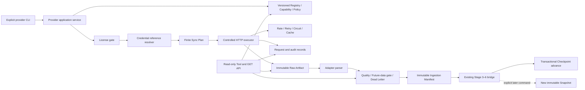

# Stage 9 Production Data Provider Design

Status: `APPROVED`
Design date: 2026-07-29
Approval phrase received: `批准设计并继续实现`
Recommended route: **Route C — governed Provider control plane with controlled
reference adapters**

This is a design document, not an implementation record. No Stage 9 branch,
migration, dependency, production code, Tool Registry change or Live request has
been created or executed. `main` remains unchanged in Git history; this document and
the capability matrix are untracked design artifacts until approval.

## 1. Decision summary

Stage 9 should add one Provider control plane in front of every production data
source. Adapters may describe a request and parse a response, but they may not open
their own network connection, resolve credentials, decide whether a license permits
storage, write business tables, create a Snapshot, run an Agent or generate a
Report.

The control plane will:

1. authorize the exact Provider version and capability;
2. evaluate a versioned license policy before resolving credentials;
3. enforce a fixed endpoint policy and a finite execution budget;
4. execute HTTP through one controlled boundary;
5. persist immutable request/audit and permitted raw evidence;
6. parse to provider-neutral records without overwriting raw bytes;
7. advance an incremental checkpoint only in the same successful transaction as
   the accepted manifest;
8. bridge accepted records to existing Stage 3–6 structures;
9. require a separate explicit command to create a new immutable Snapshot;
10. expose governance state through read-only Tools and GET APIs.

Reference adapters after approval:

- `SEC_EDGAR_PUBLIC_V1`: offline contracts and a production-capable adapter whose
  Live use remains separately approval-gated.
- `TUSHARE_PRO_V1`: offline contracts and parser/planning logic; production Live
  remains `BLOCKED` until license, HTTPS REST endpoint, Token entitlement and
  storage rules are approved.

Contract-only blocked Providers:

- A-share disclosure bodies;
- licensed U.S. EOD;
- production Embedding.

The design therefore expects Stage 9 engineering to end as `CONDITIONAL GO` unless
separate Live approvals and provider rights are obtained. Offline engineering success
cannot turn a blocked Live source into `PASS`.

## 2. Baseline and repository audit

The design audit was performed on `main` at
`66788faa0df8b753e576ccd9cf550868cc457c37`. The worktree and index were clean before
the two requested design files were created. The Stage 8 baseline records 2028
passing default tests and Alembic head `0007_verifiable_reports`; those historical
results were inspected, not rerun as part of this design-only gate.

### Existing capabilities to reuse

- `DataProviderAdapter`, `ProviderRegistry` and typed provider envelopes;
- `SafeHttpClient` with network-off default, exact host allowlist, HTTPS-only
  validation, DNS/IP checks, pinned resolution, response size limits, bounded
  redirects, retry and safe URL rendering;
- process-local response cache and monotonic rate limiter;
- `data_providers`, provider instrument mappings, ingestion runs, request logs,
  immutable raw payloads, provider facts/documents and immutable Snapshots;
- durable `LocalBlobStorage` with checksum verification, anchored paths and atomic
  pair handling;
- explicit CLI ingestion and Snapshot creation;
- read-only data Tools and GET APIs;
- immutable DocumentVersion, Retrieval Run, Calculation Run, Research Package and
  Report chains;
- default pytest external-network guard and separate `live_tests`;
- LF-pinned fixture paths and checksum manifests;
- project-owned PostgreSQL start/stop scripts.

### Gaps Stage 9 must close

- existing registry metadata is process-local and is not an immutable, versioned
  production control plane;
- provider status and terms fields are not a complete license decision record;
- current credential flags do not provide a secret-free Credential Reference;
- existing adapters can conceptually own `fetch`; a production adapter needs a
  stronger rule that all network work flows through the controlled executor;
- rate limiting and cache are process-local, and there is no circuit-breaker state;
- ingestion has no finite multi-slice Sync Plan, transactional Checkpoint, pause,
  resume, cancel or budget carry-forward model;
- there is no production Raw Artifact/Manifest distinction governed by storage
  rights;
- data quality, dead-letter, freshness, health and Live validation are not complete
  persisted control-plane concepts;
- a rare database commit failure can leave an orphan Blob; Stage 4 recorded this as
  an open medium-risk item and Stage 9 must close it before Live volume;
- project scripts have safe start and stop behavior, but no checked-in status script
  or unified non-destructive provider preflight.

### Boundaries that remain correct

- API and Agent-visible Tools are read-only;
- writes occur only through explicit CLI/internal services;
- Tool/API reads never refresh, download, parse, index, embed, calculate or build a
  Snapshot;
- fixtures remain `FIXTURE`, `OFFLINE`, `NOT_LIVE`;
- SEC metadata is not a filing body;
- Synthetic evidence cannot fill a real-company gap.

The current canonical metadata registry is an additive 40-Tool Stage 8 catalog:
22 Stage 3–6 source/query Tools, eight Stage 7 Research query Tools and ten Stage 8
Report query Tools. All current registrations are read-only, do not write and do not
require network access. The Stage 9 design proposes ten additional Provider query
Tools; they are governance readers, not sync executors.

## 3. Route comparison

Scoring uses 1 (weak) to 5 (strong). Cost reflects engineering effort, so a higher
score means lower initial cost.

| Criterion | Route A: direct calls | Route B: one Provider first | Route C: control plane + adapters |
|---|---:|---:|---:|
| Initial delivery cost | 5 | 4 | 2 |
| Credential isolation | 1 | 3 | 5 |
| License enforcement | 1 | 2 | 5 |
| SSRF/HTTP consistency | 1 | 3 | 5 |
| Audit and reproducibility | 1 | 3 | 5 |
| Incremental resume | 1 | 3 | 5 |
| Provider replacement | 1 | 2 | 5 |
| Cross-market symmetry | 1 | 2 | 5 |
| Failure containment | 1 | 3 | 5 |
| Long-term maintainability | 1 | 2 | 5 |

### Route A

Direct Provider calls inside existing services are fast initially, but duplicate
credential, HTTP, retry, logging and licensing decisions. A Provider can write a
business table before raw evidence is committed, and source-specific code can
silently mix Live data into historical state. This route is rejected.

### Route B

Implementing SEC or Tushare alone limits the first change, but it encourages
Provider-specific control concepts and forces a later migration when the second
market arrives. It does not solve the present need for a consistent authorization
and evidence boundary. This route is not selected.

### Route C

Route C costs more before the first Live byte, but it makes the safety properties
central and testable. Provider adapters become replaceable translations behind one
governed execution path. It also lets blocked sources have explicit contracts and
health states without pretending they are available. **Route C is approved by this
design recommendation.**

## 4. Architecture



No arrow exists from a GET API or Agent-visible Tool to `EXEC`, `PARSE`, `BRIDGE`,
`CHECKPOINT` or `SNAPSHOT`.

## 5. Package and dependency boundaries

Proposed production packages after approval:

```text
src/stock_research_agent/domain/providers/
├── enums.py
├── schemas.py
├── policies.py
├── capabilities.py
├── licenses.py
├── credentials.py
├── sync.py
├── artifacts.py
├── quality.py
├── health.py
├── errors.py
└── repositories.py

src/stock_research_agent/providers/
├── control_plane.py
├── http_executor.py
├── rate_limit.py
├── retry.py
├── circuit_breaker.py
├── cache.py
├── sec_edgar/
└── tushare/

src/stock_research_agent/db/
├── models/providers.py
└── repositories/providers.py
```

Rules:

- domain code imports no FastAPI, Typer, SQLAlchemy, filesystem or network module;
- adapters import typed domain contracts and cannot create a Session;
- adapters do not receive raw secret values or an unrestricted HTTP client;
- the executor does not understand financial or filing semantics;
- repositories do not make network calls;
- API/Tool query services cannot construct a sync application service;
- existing Stage 4 data-access tables remain bridge targets, not a second control
  plane;
- historical Stage 2–8 tables are not altered by migration `0008`.

## 6. Core interfaces

The implementation plan may refine module placement, but not weaken these contracts.

```python
class ProductionProviderAdapter(Protocol):
    descriptor: ProviderAdapterDescriptor

    def plan(
        self,
        request: ProviderSyncRequest,
        checkpoint: ProviderSyncCheckpoint | None,
    ) -> ProviderSyncPlanDraft: ...

    def build_request(
        self,
        slice_: ProviderSyncSlice,
        context: ProviderExecutionContext,
    ) -> ProviderHttpRequestTemplate: ...

    def parse_response(
        self,
        context: ProviderParseContext,
        response: ProviderHttpResponse,
    ) -> ProviderBatch: ...
```

`ProviderHttpRequestTemplate` contains an endpoint template ID, method, normalized
non-secret parameters, accepted content types and response bound. It cannot contain
an arbitrary URL, raw credential, Authorization/Cookie header or caller-controlled
filesystem path.

```python
class CredentialResolver(Protocol):
    def resolve_for_execution(
        self,
        reference: CredentialReference,
        declared_names: frozenset[str],
    ) -> ResolvedCredentialContext: ...
```

The returned object is in-memory only, has a redacted representation and cannot be
serialized by Pydantic. The resolver rejects undeclared environment variable names.

```python
class ControlledProviderExecutor(Protocol):
    def execute(
        self,
        template: ProviderHttpRequestTemplate,
        context: ProviderExecutionContext,
        budget: ProviderExecutionBudget,
    ) -> ProviderHttpResponse: ...
```

The executor orders gates as:

1. Provider/adapter version;
2. capability;
3. production status;
4. license policy;
5. explicit Live authorization;
6. finite budget;
7. circuit breaker;
8. endpoint and request schema;
9. credential reference resolution;
10. cache decision;
11. network execution.

No credential is resolved if an earlier gate blocks the request.

```python
class ProviderBridge(Protocol):
    def stage(
        self,
        manifest: ProviderIngestionManifest,
        batch: ProviderBatch,
    ) -> ProviderBridgeResult: ...
```

The bridge writes only existing provider/source structures that match the explicit
capability. It does not normalize financials, parse documents, build retrieval
indexes, calculate metrics, create Snapshots, run research or render reports.

## 7. Provider definition and versioning

`ProviderDefinition` is immutable after activation. Its identity is
`(provider_code, definition_version)` and binds:

- provider and adapter type/version;
- exact capability version set;
- base endpoint policy version;
- license policy version;
- Credential Reference ID or `NONE`;
- Provider Policy version;
- production and health status;
- optional `legacy_data_provider_id` with `RESTRICT` deletion, linking the Stage 4
  source catalog without mutating it.

Changing an endpoint host, adapter schema, license, credential scope or data contract
creates a new definition. Historical Sync Runs keep their old definition.
`TEST_ONLY` definitions cannot be selected by a production policy.

The versioned registry aggregates the exact domain contracts
`ProviderCapability`, `ProviderPolicy`, `SourceLicensePolicy` and
`CredentialReference`; these are separate persisted records rather than mutable
attributes inferred from the adapter.

## 8. Capability model

Every Sync Request names exactly one capability:

- `FETCH_SECURITY_MASTER`
- `FETCH_MARKET_CALENDAR`
- `FETCH_EOD_PRICES`
- `FETCH_FINANCIAL_STATEMENTS`
- `FETCH_FINANCIAL_METRICS`
- `FETCH_CORPORATE_ACTIONS`
- `FETCH_DISCLOSURE_METADATA`
- `FETCH_DISCLOSURE_DOCUMENT`
- `FETCH_SEC_SUBMISSIONS`
- `FETCH_SEC_FILING_DOCUMENT`
- `GENERATE_EMBEDDING`

A capability records market, data domain, security type, incremental/backfill/as-of/
revision/raw support, credential requirement, version and status. No code infers
capability from a Provider name or matching prefix.

## 9. License gate

`SourceLicensePolicy` is a versioned decision record containing the fields required
by the Stage 9 prompt: access class, raw/normalized storage, cache, TTL,
redistribution, excerpt, retention, attribution, commercial use, derived data,
deletion, source reference, review/approval identity and status.

Enforcement:

- `UNKNOWN` and `BLOCKED`: no credential resolution, no network, no production
  write;
- `RESTRICTED`: the executor and storage layer enforce each limit;
- `raw_storage_allowed=false`: response bytes are not persisted or hashed as a way
  to evade the rule; evidence-grade ingestion returns `BLOCKED_RAW_RETENTION`;
- a screenshot, excerpt or checksum is not a substitute for prohibited acquisition;
- cache creation requires both Provider Policy and License Policy approval;
- every Sync Run binds the exact license policy version;
- policy expiry or terms change blocks new runs but does not rewrite historical
  audit records.

The authoritative design-time decisions are in
`docs/provider-capability-matrix.md`.

## 10. Credential boundary

The database stores only:

- provider code;
- reference name;
- credential type;
- declared environment variable names;
- secret backend type;
- status and last validation time.

It never stores a Token, API key, password, Cookie, Authorization header, private
key, connection string, secret prefix, suffix or secret hash.

Supported backends:

- `LOCAL_ENV_REFERENCE`;
- `OPERATING_SYSTEM_SECRET_REFERENCE`;
- `FUTURE_SECRET_MANAGER_REFERENCE`.

Only `LOCAL_ENV_REFERENCE` needs an implementation in Stage 9. The other backends
remain explicit `BLOCKED` references. `.env.example` declares variable names only.
Errors and logs refer to the Credential Reference ID and safe status, never the
resolved value.

Cache isolation uses a non-secret credential-scope version stored in the reference,
not a hash of the credential value.

## 11. Controlled HTTP security

The executor extends the existing safe boundary rather than bypassing it.

Mandatory controls:

- HTTPS only; no downgrade;
- exact host allowlist and endpoint template IDs;
- reject user info, fragments, IP-literal hosts, non-443 ports and arbitrary URLs;
- resolve every hop and reject private, loopback, link-local, multicast, reserved,
  unspecified and metadata-service addresses;
- pin the validated address for the request and validate every redirect;
- cross-domain redirects are rejected unless the exact source and target pair is in
  a signed Provider endpoint policy; Stage 9 reference policies allow none;
- reject DNS rebinding by resolving and pinning each request/redirect independently;
- `trust_env=false`, no ambient proxy or `.netrc`;
- reject cookies and strip sensitive headers;
- finite connect, read, write, pool and total deadlines;
- compressed and decompressed byte ceilings; `Accept-Encoding: identity` by default;
- content-length precheck plus streamed actual-byte bound;
- exact content-type allowlist with optional deterministic magic-byte validation;
- document and structured-response bounds differ;
- normalized parameter schema rejects path traversal, control characters, header
  injection, unknown query/body fields and unbounded ranges;
- audit records contain a redacted endpoint identity and parameter fingerprint, not
  secret-bearing URLs, bodies or headers.

Tushare requires POST and puts a Token in the JSON body. The executor must inject
that field only after audit fingerprinting and immediately before transport. Request
serialization, exceptions and debug output must have a redacted representation.
Because the reviewed REST document shows an HTTP endpoint, production Tushare remains
blocked until an official HTTPS REST endpoint is confirmed.

## 12. Rate limit, retry and circuit breaker

### Rate limit

Rate buckets are scoped by Provider definition, capability and non-secret credential
scope. Limits are versioned and cannot exceed official rules. SEC has a documented
aggregate ceiling of 10 requests/second; the project policy must use a conservative
lower default and a single aggregate bucket, not 10 requests/second per worker.
Tushare limits come from current entitlement and endpoint documentation.

### Retry

At most three total attempts, with deterministic bounded exponential backoff and
honored bounded `Retry-After`. Retry only:

- transient connection/timeout failures;
- 429;
- selected 5xx.

Never retry:

- license, credential or entitlement rejection;
- 400/401/403/404 unless a Provider-specific contract explicitly classifies a
  transient response;
- schema/content-type/security rejection;
- invalid identifier or future data;
- raw-retention block.

Budgets count every attempt. Resume does not restore consumed attempts, requests,
bytes, records or duration.

### Circuit breaker

Persisted states are `CLOSED`, `OPEN`, `HALF_OPEN`. State is isolated by Provider
definition and production credential scope. `OPEN` blocks before credential
resolution/network. `HALF_OPEN` permits one finite health probe under explicit
policy. Business `NOT_FOUND` does not open the circuit. Authentication, entitlement,
schema drift and security incidents use explicit classifications and audit events.
Fixture failures never affect a production circuit.

## 13. Cache

A production cache is persistent and license-gated. The key binds:

- provider definition and adapter version;
- capability;
- endpoint template;
- canonical non-secret parameters;
- credential scope version;
- license policy version;
- research/as-of scope where applicable.

The key never includes a secret or secret hash. Entries are immutable, checksummed
and expire deterministically. A hit writes an audit event. Authentication errors,
security rejections and unapproved bodies are not cached. A cached artifact is never
reported as current after expiry. Document-body cache records are distinct from
evidence-grade Raw Artifacts.

## 14. Sync request, plan and state machine

### Request

`ProviderSyncRequest` is immutable and requires:

- Provider definition version;
- one capability version;
- Security/universe scope;
- research_as_of_time;
- bounded date/period window;
- mode (`INCREMENTAL`, `BACKFILL`, `HEALTH_PROBE`);
- Provider Policy version;
- License Policy version;
- Credential Reference ID;
- request, record, byte, document and duration budgets;
- explicit Live authorization reference, or offline mode.

Its idempotency key is a SHA-256 over canonical non-secret identity fields. A
credential value is never part of the key.

### Plan

The adapter produces a finite deterministic plan before execution. Slices have
stable IDs, total order, dependencies, endpoint template, bounded parameters,
expected record range and budget reservation. A plan cannot add slices based on
document instructions or response content beyond a pre-approved bounded pagination
rule. Pagination itself has a hard page count.

### Run

States:

```text
PLANNED -> RUNNING -> PAUSED -> RUNNING
RUNNING -> COMPLETED | PARTIAL | BLOCKED | FAILED | CANCELLED
PLANNED -> CANCELLED | BLOCKED
PAUSED  -> CANCELLED | BLOCKED | FAILED
```

Terminal states are immutable. Resume creates a new execution lease/event on the
same Run and retains all consumed budgets. A concurrent worker must acquire one
database lease/lock; it cannot execute the same slice twice. State transitions are
append-audited.

`COMPLETED` requires no unresolved critical quality issue and all planned slices
terminal. `PARTIAL` preserves accepted artifacts and an honest reason. `BLOCKED`
means a policy, credential, entitlement, evidence or authorization prerequisite is
missing. `FAILED` is an internal/provider failure, not a missing entitlement.

## 15. Checkpoint semantics

Checkpoint scope is:

`provider_definition + capability + security/universe + partition + adapter_version`.

The value is typed, not an opaque executable expression. Examples:

- SEC: accepted timestamp, accession number and validated document identity;
- Tushare daily: trading date plus provider security/universe partition;
- Tushare statements: announcement/update watermark plus provider record identity.

Rules:

- checkpoint advances only after Raw Artifact, parsed batch, quality result,
  Ingestion Manifest and bridge writes commit together;
- a failed/blocked slice never advances it;
- out-of-order slices cannot advance past an unresolved earlier slice;
- compare-and-swap version prevents lost updates;
- new/checksummed revisions create new records even when an earlier watermark was
  processed;
- pause/resume retains the checkpoint and budget;
- rollback leaves the prior checkpoint intact.

## 16. Raw Artifact and Blob atomicity

`ProviderRawArtifact` is immutable and records:

- Provider definition/capability/Sync Run/request attempt;
- safe endpoint identity and provider record/document identity;
- retrieval, publication and effective times;
- content type and exact byte size;
- SHA-256;
- opaque relative Blob URI;
- origin/access/live markers;
- license policy version and retention/deletion decision;
- source revision and supersession relation;
- encryption/storage backend metadata without local absolute paths.

Idempotency:

- identical Provider/source identity and checksum reuses the artifact;
- same source identity with changed bytes creates a new revision;
- conflicting same-version bytes create `CHECKSUM_CONFLICT` and stop bridge writes.

The existing `BlobStorage` remains the byte store. Stage 9 adds a durable pending
artifact/outbox record so Blob creation and database commit can be reconciled. A
failed database commit leaves a bounded, auditable pending Blob eligible for explicit
garbage collection; it is never silently treated as accepted evidence. Atomic file
creation and checksum verification remain mandatory.

Raw bytes are never overwritten by parsed or normalized output.

## 17. Ingestion Manifest and Provider records

An immutable `ProviderIngestionManifest` binds:

- Sync Run/slice/request attempt;
- Raw Artifact;
- adapter/schema/mapping versions;
- raw checksum and canonical parsed checksum;
- record counts and stable record IDs;
- publication/as-of decisions;
- quality summary;
- accepted/rejected/unmapped counts;
- bridge result IDs;
- checkpoint before/after;
- origin/access/live/license markers.

Provider records are value objects within the manifest projection or the existing
Stage 4 provider-fact/source tables. Unknown mappings are `UNMAPPED`, not guessed.
Missing numeric values remain missing; zero is preserved only when present. Decimal
input is parsed from exact textual values, never binary float.

## 18. Existing-system bridge

Approved bridge mapping:

| Capability | Existing target | Prohibited shortcut |
|---|---|---|
| Security master | Stage 3 external identifiers/mappings through an explicit reviewed mapping service | Do not overwrite issuer/security identity from a provider name alone. |
| EOD prices | Stage 4 `daily_price_bars` plus provider/raw lineage | Do not call prices “adjusted” unless the endpoint and adjustment type say so. |
| Corporate actions | Stage 4 `corporate_actions` | Do not infer actions from price discontinuities. |
| Financial statements | Stage 4 provider financial facts, then explicit Stage 5 normalization | Do not write normalized facts or metrics directly. |
| SEC Company Facts | Stage 4 provider financial facts with taxonomy/unit/filing lineage | Do not treat frames as company-quarter truth without exact period review. |
| Disclosure metadata | Stage 4 source-document metadata | Do not mark body `AVAILABLE`. |
| Filing/disclosure body | Stage 4 raw/source document, then explicit Stage 6 DocumentVersion registration | Do not parse/index during sync. |

After ingestion, an operator may explicitly create a new Snapshot. No historical
Snapshot, Calculation Run, Retrieval Run, Research Run, Package or Report is
modified. No downstream workflow starts automatically.

## 19. Future-data and revision rules

- any record published after `research_as_of_time` is rejected from the manifest
  accepted set and recorded as `FUTURE_DATA`;
- unknown `source_published_at` produces `UNKNOWN_PUBLISHED_AT`; it cannot support
  strict historical evidence;
- `retrieved_at` never substitutes for `source_published_at`;
- Provider revisions and restatements create append-only versions with both original
  and revised lineage;
- SEC filing acceptance/filed time, primary document and accession stay distinct;
- Tushare announcement date, actual announcement date, report period and update/report
  type remain distinct;
- old data and citations remain accessible through their exact historical records.

## 20. SEC reference adapter

Officially approved endpoint templates for design:

- `https://data.sec.gov/submissions/CIK##########.json`;
- `https://data.sec.gov/api/xbrl/companyfacts/CIK##########.json`;
- `https://www.sec.gov/Archives/edgar/data/{cik}/{accession_without_dashes}/{validated_path}`.

The adapter distinguishes:

- submissions metadata;
- filing metadata;
- filing index;
- primary filing document;
- complete submission text;
- XBRL instance/facts;
- exhibit;
- official filing body.

Accession number plus validated document path is the document idempotency identity.
The CIK is zero-padded where the API requires it. A document filename must come from
the validated filing index for the same accession and pass a strict basename/path/
extension policy. An index or submissions row never becomes body evidence.

SEC requires no API key for public data, but automated requests need a declared
User-Agent with a real contact identity and must respect the aggregate official rate
limit. A contact reference is therefore a production prerequisite even though it is
not an authentication secret.

Stage 9 offline tests use source-attributed minimal fixtures. A finite Micron Live
validation may run only after the separate phrase
`批准执行该Provider的有限Live验证` and a disclosed request/byte budget.

## 21. Tushare reference adapter

The offline contract covers:

- `stock_basic`;
- `trade_cal`;
- `daily`;
- `income`;
- `balancesheet`;
- `cashflow`;
- `fina_indicator`;
- `dividend`;
- `disclosure_date`.

Endpoint-specific fields, limits, units, report types and update flags remain raw.
Provider-computed indicators do not replace Stage 5 canonical formulas. Disclosure
dates are metadata, not a PDF/HTML body.

Production remains blocked because:

- the current Token and its entitlements are unknown;
- the official service agreement reviewed grants personal, non-transferable,
  non-commercial, revocable and time-limited use;
- raw retention, cache, normalized/derived storage, excerpts and redistribution are
  not explicitly granted;
- the reviewed REST document demonstrates an HTTP endpoint, while this project
  requires HTTPS.

No adapter may fall back to a public webpage, unofficial endpoint, SDK transport,
scraper or alternative Provider. An entitlement failure maps to
`BLOCKED_PROVIDER_ENTITLEMENT` and is not retried.

## 22. Blocked Provider contracts

### A-share disclosure bodies

SSE, SZSE and CNINFO are evaluated as formal-source candidates. Public visibility or
a market-participant interface specification does not establish a public production
API or rights to automate, cache, retain raw bodies, create excerpts or redistribute.
All three remain `UNKNOWN` license and `BLOCKED` production status. Industrial FII
body evidence cannot be filled by scraping.

### Licensed U.S. EOD

The control-plane capability exists, but no vendor-specific adapter, endpoint or
schema will be implemented until the user selects a vendor and approves its price,
license, caching, display, retention and redistribution terms. SEC data is not EOD
market data.

### Production Embedding

Only governance/health status is modeled. No model, SDK, endpoint, credential or
network call is added. Sending provider-restricted text to an embedding service
requires a separate data-processing and residency decision.

## 23. Data quality, dead letters and freshness

Quality categories include every category requested by the Stage 9 prompt:
schema drift, missing fields, identifiers/dates, future data, duplicates, checksum,
unit/currency/period/restatement conflict, staleness, unknown publication time,
content type, incomplete document, missing mapping, license restriction and
entitlement block.

Critical/high issues are never swallowed. A Run with unresolved critical issues
cannot be `COMPLETED`.

Dead letters contain safe source identity, artifact reference, typed error, retry
classification and resolution state. They do not contain secrets or full sensitive
payloads. Repair/replay is explicit and bounded.

The exact append/audit contracts are `ProviderDeadLetter` and
`ProviderDataQualityIssue`. Freshness uses a versioned
`ProviderFreshnessPolicy` scoped by Provider/capability/market and the correct
timezone and, where available, a market calendar. `UNKNOWN` never becomes `FRESH`.
Until Stage 4's calendar placeholder is backed by an approved calendar source,
calendar-dependent freshness can be `UNKNOWN` or `BLOCKED`; fixed natural-day rules
will not be invented.

## 24. Health and readiness

`ProviderHealthSnapshot` is append-only and records configuration, credential,
license, network, entitlement, schema, freshness and circuit status plus safe
timestamps/messages. A health check has a separate tiny budget and cannot write
business data, create a Snapshot or run downstream research.

Readiness is deterministic:

- Provider definition active;
- capability active;
- license approved/restricted-with-enforceable-rules;
- credential reference configured;
- endpoint policy approved;
- circuit not open;
- last schema/health acceptable;
- Security mapping present;
- required raw/evidence retention permitted.

Readiness returns the limiting reasons; it does not automatically call a Provider.

## 25. Database design and migration

After approval, migration `0008_create_production_data_providers` creates the 20
control-plane tables requested by the prompt without changing Stage 2–8 tables:

1. `provider_definitions`
2. `provider_capabilities`
3. `provider_policies`
4. `provider_license_policies`
5. `provider_credential_references`
6. `provider_sync_requests`
7. `provider_sync_plans`
8. `provider_sync_runs`
9. `provider_sync_checkpoints`
10. `provider_request_attempts`
11. `provider_raw_artifacts`
12. `provider_ingestion_manifests`
13. `provider_cache_entries`
14. `provider_circuit_breakers`
15. `provider_dead_letters`
16. `provider_data_quality_issues`
17. `provider_freshness_policies`
18. `provider_health_snapshots`
19. `provider_audit_events`
20. `provider_live_validation_runs`

Key constraints:

- UUID primary keys and UTC timestamps;
- string state fields with CHECK constraints, not PostgreSQL native ENUM;
- immutable/version unique keys for definition/capability/policy/license/artifact/
  manifest/health/audit records;
- `RESTRICT` deletion from historical Runs, attempts, artifacts, manifests and
  checkpoints;
- no destructive cascade into Stage 2–8 evidence;
- terminal Run trigger prevents mutation;
- artifact/manifest/audit append-only triggers;
- checkpoint compare-and-swap version and scope unique constraint;
- request/run idempotency unique constraints;
- raw checksum format and byte-count checks;
- dates/times and budget counters constrained non-negative and finite;
- Credential Reference columns cannot contain secret values by schema and Pydantic
  allowlist;
- state-transition tables and domain rules share the same explicit transition map.

Indexes correspond to the prompt's actual paths:

- Provider code + definition/adapter version;
- Provider + capability code/version;
- policy/license version;
- Credential Reference by Provider;
- request/run idempotency;
- Provider + Run status;
- checkpoint scope;
- Run + attempt number;
- Provider/source identity and raw checksum;
- manifest by Run;
- cache key and expiry;
- dead letter by Run/status;
- quality issue by Run/severity;
- health and Live validation by Provider/time.

No B-tree is created over raw bytes or large JSON. All migrations downgrade cleanly,
perform no network/credential access and insert no business or Live data.

## 26. Transaction and concurrency model

- one Run worker lease is acquired with PostgreSQL row/advisory locking;
- an attempt reserves budget atomically before network execution;
- artifact acceptance, manifest, bridge write and checkpoint update share one
  database transaction;
- Blob staging uses the durable pending/outbox identity and explicit finalize/
  reconcile operations;
- duplicate concurrent work returns an idempotent existing result or a stable
  in-progress state;
- no transaction remains open during avoidable backoff;
- request attempts and audit events are append-only even when the business
  transaction fails;
- test database migration/reset keeps the existing serialized isolation mechanism;
- development and test database identities are verified before destructive test
  schema operations.

## 27. CLI design

Read operations:

- `stock-research provider list`
- `show`, `capabilities`, `policy show`, `license show`, `health`,
  `circuit-status`, `sync-show`, `checkpoints`, `raw-artifacts`,
  `quality-issues`, `dead-letters`, `readiness`

Explicit write/control operations:

- `credential-check`
- `sync-plan`
- `sync-run`
- `sync-pause`
- `sync-resume`
- `sync-cancel`
- `repair`
- `live-check`

All write operations display Provider definition/capability/policy/license versions,
scope and finite budgets before execution. `live-check` additionally requires the
separate Live approval record. CLI accepts no arbitrary URL, storage path, SQL,
Provider class, secret value, open-ended history or “latest Snapshot” shortcut.
Ingestion never automatically builds a Snapshot, runs an Agent or generates a
Report.

## 28. GET API and read-only Tools

The existing API prefix is reused. Only GET routes are exposed:

- `/providers`
- `/providers/{provider_code}`
- `/providers/{provider_code}/capabilities`
- `/providers/{provider_code}/health`
- `/providers/{provider_code}/license`
- `/provider-sync-runs/{run_id}`
- `/provider-sync-runs/{run_id}/requests`
- `/provider-sync-runs/{run_id}/artifacts`
- `/provider-sync-runs/{run_id}/quality-issues`
- `/provider-sync-runs/{run_id}/dead-letters`
- `/provider-readiness/{security_id}`

Provider query Tools match the approved list and are all:

- `READ_ONLY`;
- `writes=false`;
- `requires_network=false`.

They return metadata and safe summaries, never secrets, complete restricted payloads,
remote headers, local paths, credential values or unapproved documents. They cannot
sync, health-probe, repair, download, parse, index, embed, create a Snapshot, run an
Agent or generate a Report.

Adding these Tools creates a new Tool Catalog version/checksum. Historical Stage 7
Runs remain bound to their original catalog. No old Run is reused under the new
catalog, and no new Tool is automatically added to a Research Policy allowlist.

## 29. Live authorization and test isolation

Default `pytest` continues to collect only `tests/`, blocks non-loopback networking,
does not read Provider secrets and expects zero skips/warnings.

Live tests live outside the default tree:

```text
tests_live/sec/
tests_live/tushare/
```

They are not run merely because design or implementation is approved. Before a first
Live request, Codex must disclose:

- Provider and official domains;
- capability and exact scope;
- request/record/byte/document/duration budgets;
- credential reference names;
- raw-storage and license decisions;
- expected cost/time;
- development/test database impact;
- rollback.

Only the exact phrase `批准执行该Provider的有限Live验证` authorizes that Provider,
capability and budget. Approval for SEC does not authorize Tushare; health approval
does not authorize backfill.

## 30. Fixture policy

New offline fixtures are minimal, deterministic and source-manifested.

- SEC fixtures may be safe, source-attributed public excerpts that exercise
  submissions/index/primary-document distinctions.
- Tushare fixtures must be synthetic contract fixtures unless a license explicitly
  permits retaining a real response crop.
- Synthetic fixtures use `SYNTHETIC_TEST_ONLY`, `NOT_COMPANY_EVIDENCE`, `OFFLINE`,
  `NOT_LIVE`.
- text uses LF; binary paths use `-text`;
- `.gitattributes`, Git Blob bytes, worktree bytes and manifest SHA-256 must match;
- no Token, Cookie, personal contact identity or unapproved full response is stored.

Fixture success is never Live success.

## 31. PostgreSQL operations

After approval, Stage 9 may:

- add `scripts/dev/status-postgres.ps1`;
- harden the project-owned start/status checks;
- report PID, version, port, readiness and safe database identity;
- add a Provider preflight that is non-destructive and secret-safe;
- improve logs and non-destructive recovery documentation.

It may not run `initdb`, delete the data directory, reset a password, change the port,
reinstall PostgreSQL, alter a global Windows Service or kill an unidentified process.

## 32. Real-company acceptance

### Micron (`MU`)

Offline acceptance can validate Security/CIK mapping, request identity, accession
idempotency, metadata/body distinction, document lineage, as-of, checkpoint and
quality contracts. Until a separately approved SEC Live validation successfully
stores exact filing bodies, 10-K/10-Q/8-K body readiness remains `BLOCKED`.

If Live is later approved and succeeds, it creates immutable Raw Artifacts and
DocumentVersion-ready inputs. It does not update an old Snapshot or Report. A new
Snapshot, Retrieval Run, Research Run and Report require explicit later commands.

### Industrial FII (`601138.SH`)

Offline acceptance can validate Tushare schemas, Security mapping, entitlement
blocking, plan/checkpoint and bridge contracts. Tushare production remains blocked
under the current design decisions. A-share official disclosure body readiness also
remains blocked. Metadata or synthetic text cannot fill the body.

Even if structured Tushare data later becomes approved, document evidence remains
blocked until an authorized disclosure-body Provider succeeds.

## 33. Error vocabulary

Stable safe errors include:

- `PROVIDER_NOT_FOUND`
- `PROVIDER_VERSION_MISMATCH`
- `PROVIDER_BLOCKED`
- `CAPABILITY_NOT_ALLOWED`
- `LICENSE_UNKNOWN`
- `LICENSE_BLOCKED`
- `LICENSE_RESTRICTION`
- `CREDENTIAL_REFERENCE_MISSING`
- `CREDENTIAL_NOT_CONFIGURED`
- `BLOCKED_PROVIDER_ENTITLEMENT`
- `LIVE_AUTHORIZATION_REQUIRED`
- `CIRCUIT_OPEN`
- `BUDGET_EXHAUSTED`
- `HTTP_POLICY_REJECTED`
- `CONTENT_TYPE_MISMATCH`
- `RESPONSE_TOO_LARGE`
- `SCHEMA_DRIFT`
- `RAW_RETENTION_BLOCKED`
- `CHECKSUM_CONFLICT`
- `FUTURE_DATA`
- `UNKNOWN_PUBLISHED_AT`
- `PROVIDER_MAPPING_MISSING`
- `CHECKPOINT_CONFLICT`
- `SYNC_ALREADY_RUNNING`

No error exposes SQL, a stack, raw headers, secret material, absolute paths or a full
restricted response.

## 34. TDD and verification plan after approval

Implementation uses vertical TDD:

1. failing domain contract tests;
2. minimum domain implementation;
3. failing model/migration tests;
4. PostgreSQL implementation;
5. failing application/adapter contract tests;
6. minimum offline adapter implementation;
7. failing Tool/API/CLI contracts;
8. bounded query/control implementation;
9. two Reflection rounds and all critical/high fixes;
10. complete offline regression and migration replay.

Required gates:

```text
uv sync
uv run ruff check .
uv run ruff format --check .
uv run mypy src
uv run pytest -W error
uv run alembic current
uv run alembic upgrade head
uv run alembic downgrade -1
uv run alembic upgrade head
uv run alembic current
```

Default tests cover registry/versioning, license states, credential references,
HTTP/SSRF, rate/retry/circuit/cache, finite Sync, pause/resume/cancel, checkpoint
transactions, artifact/manifest immutability, quality/dead-letter/freshness/health,
SEC/Tushare offline contracts, future data, bridge boundaries, Tools/API/CLI,
PostgreSQL constraints/concurrency and LF checks.

Golden expectations are independently authored and never generated by the code under
test. No SQLite substitutes for PostgreSQL; no skip/xfail or retry hides failures.

## 35. Reflection and reporting

Round 1 reviews data-platform architecture, licensing/compliance, security,
reliability, financial data semantics, database and tests. All `CRITICAL` and `HIGH`
findings are fixed.

Round 2 reruns the 35 prompt checks, including secret isolation, license/network
gates, SSRF, cache credential scope, checkpoint/budget retention, artifact
immutability, future/synthetic rejection, blocked Providers, default offline tests,
migration replay and historical immutability.

The implementation report distinguishes:

- offline Provider engineering;
- each Provider's license/credential/Live state;
- SEC and Tushare contract state;
- real-company data readiness;
- Tool/API/CLI and PostgreSQL results;
- unresolved engineering findings versus external data blockers.

## 36. Rollout and rollback

Rollout after design approval:

1. create `stage-9/production-data-providers`;
2. commit the approved design separately;
3. write a checked, task-level implementation plan;
4. implement the control plane and offline reference contracts;
5. run offline acceptance and Reflection;
6. stop before any Live request;
7. request separate Provider/capability/budget authorization.

Rollback:

- application rollback removes Stage 9 code while Stage 2–8 remain unchanged;
- migration downgrade removes only the 20 Stage 9 tables;
- Raw Blobs created by an approved Live run follow their bound license/deletion
  policy and explicit reconciliation workflow;
- no rollback modifies historical Snapshots, Runs, Packages or Reports.

## 37. Risks and explicit trade-offs

| Risk | Decision |
|---|---|
| More tables and initial work than a direct adapter | Accepted to make license, credential, audit and resume properties enforceable. |
| Stage 4 Provider records overlap conceptually | Keep Stage 4 as evidence/bridge storage; Stage 9 is immutable production governance and references the legacy Provider ID. |
| Blob/database atomicity cannot be one native transaction | Use durable pending/outbox reconciliation and never report an uncommitted Blob as accepted evidence. |
| SEC public access could still be rate-limited or unavailable | Conservative aggregate rate, validators/cache, circuit breaker and finite retry. |
| Tushare contract is technically clear but legally restrictive | Keep production blocked; do not let engineering readiness override terms. |
| A-share bodies may remain unavailable | Preserve a formal blocker; do not scrape or synthesize. |
| Tool Catalog changes affect Run reuse | Version the catalog; old Runs remain bound and new Tools require explicit policy allowlisting. |
| Calendar-dependent freshness lacks a production calendar | Return `UNKNOWN`/`BLOCKED`, not a guessed natural-day result. |

## 38. Design self-check

- [x] Stage 1–8 reports, designs and Reflection findings relevant to Providers were
  reviewed.
- [x] Existing Provider, HTTP, RawPayload, BlobStorage, Snapshot, financial,
  document, Tool, API, CLI, fixture and PostgreSQL-script boundaries were audited.
- [x] Only official/formal Provider sources were used.
- [x] Routes A, B and C were compared for security, cost, authorization, stability
  and maintenance.
- [x] A final recommendation and trade-offs are explicit.
- [x] Provider Registry, Capability, Policy, License and Credential Reference are
  defined.
- [x] HTTP, SSRF, redirect, size, content-type, rate, retry, circuit and cache
  boundaries are defined.
- [x] Sync Request, finite Plan, Run, budget, pause/resume/cancel and transactional
  Checkpoint rules are defined.
- [x] Raw Artifact, Ingestion Manifest, Blob reconciliation, quality, dead letter,
  freshness, health and audit are defined.
- [x] SEC metadata/index/body/XBRL/exhibit distinctions are explicit.
- [x] Tushare capability, entitlement, license and HTTPS blockers are explicit.
- [x] A-share disclosure, U.S. EOD and Embedding remain blocked without guessing.
- [x] Existing data/financial/document bridges and historical immutability are
  explicit.
- [x] Tool/API read-only and CLI explicit-write boundaries are explicit.
- [x] Default offline and separately approved Live validation are explicit.
- [x] Fixture provenance, synthetic isolation and LF/checksum rules are explicit.
- [x] PostgreSQL migration, constraints, indexes, concurrency and operations are
  covered.
- [x] Industrial FII and Micron readiness cannot be upgraded using metadata,
  fixture or synthetic evidence.
- [x] Stage 10, trading, implicit Agent/report execution and unapproved models are
  out of scope.
- [x] No unresolved design placeholder is used to authorize production; unknown
  critical fields are `UNKNOWN_REQUIRES_REVIEW` and block production.

## 39. Approval gate

The proposed design is complete and recommends Route C. The current action is to
stop. Implementation, branch creation, migration work, dependency installation,
Tool Registry changes and every Live request remain prohibited until the user
replies exactly:

`批准设计并继续实现`

Even after that approval, a first Live request still requires the separate,
Provider-specific phrase:

`批准执行该Provider的有限Live验证`
